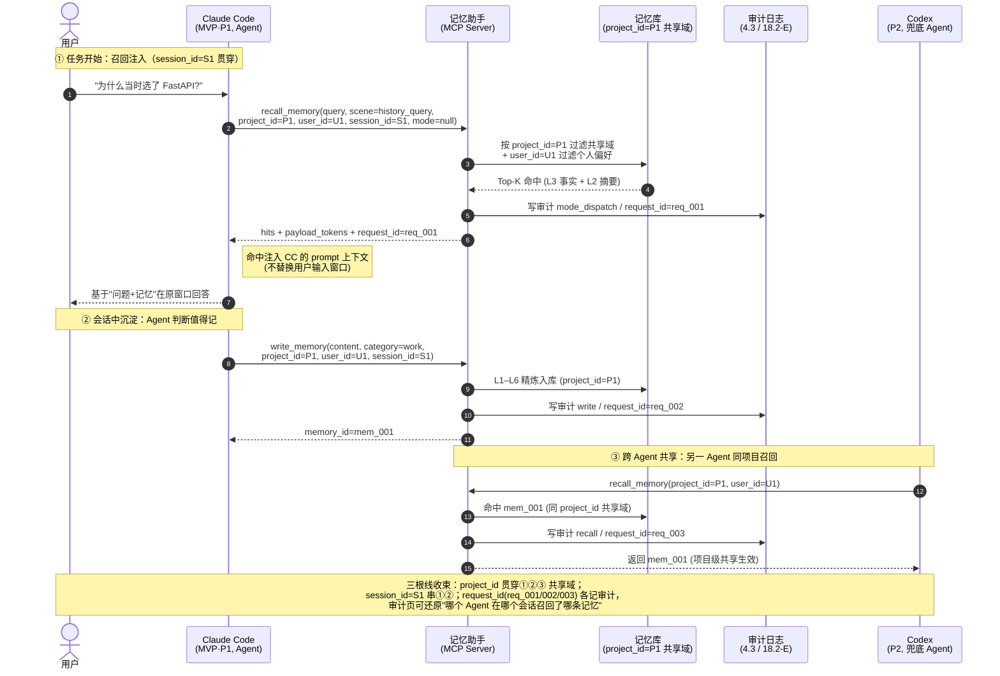

# 多 Agent 记忆助手 - 需求规格书

**版本**: v1.0  
**日期**: 2025-07-16  
**状态**: 设计评审版

---

## 一、产品概述

### 1.1 产品定位
多 Agent 记忆助手是一个具备**自净化、自生长**能力的智能记忆系统，支持跨会话、跨 Agent 的记忆共享与个性化偏好学习，为多租户（个人/团队/企业）提供安全、高效的记忆管理服务。

### 1.2 核心价值
- **记忆延续性**：打破单会话限制，实现跨会话知识积累
- **个性化适配**：学习用户偏好，主动适配 Agent 行为
- **安全隔离**：严格的多租户数据隔离与权限控制
- **自动化治理**：自净化去重、自生长优化、遗忘机制

### 1.3 目标用户
- **个人用户**：日常对话记忆、偏好学习
- **团队用户**：团队协作记忆、代码规范共享
- **企业用户**：企业知识库、合规要求、跨团队协作

---

## 二、核心功能设计

### 2.1 L1-L6 六层记忆架构

**L0/L1 访问边界（公共不变，所有召回模式共用）**：

- **L0 原始层**：AES-256-GCM 加密存储，**除脱敏审计用途外禁止任何在线访问**；不解密、不回灌、不进 prompt。
- **L1 清洗脱敏层**：已完成姓名/电话/邮箱/API Key 等敏感信息脱敏，是**唯一允许进入 prompt 的原始内容形态**；默认不回灌，仅在「用户强需求」或「相关性单项 ≥0.9」时以**脱敏版**回灌用于溯源核验。
- L2-L6 为提炼层，按 §2.4.2 公共规则与 §2.4.3 模式规则参与召回。

```
┌─────────────────────────────────────────────────────────────────┐
│  L0: 原始对话（加密存储）                                        │
│  - AES-256-GCM 加密                                              │
│  - 用途：审计/恢复/证据                                          │
│  - 访问：仅管理员解密                                            │
└─────────────────────────────────────────────────────────────────┘
                            ↓
┌─────────────────────────────────────────────────────────────────┐
│  L1: 清洗脱敏（不限长度）                                        │
│  - 去除：姓名、电话、邮箱、API Key、Token 等敏感信息              │
│  - 替换为占位符：[姓名]、[API_KEY:service_name]                  │
│  - 保留：技术内容、代码、逻辑推理                                │
└─────────────────────────────────────────────────────────────────┘
                            ↓
┌─────────────────────────────────────────────────────────────────┐
│  L2: 摘要提取 + 元数据（≤300字，~150-200 Token）                │
│  - 时间戳、来源、类型标签                                        │
│  - 核心内容摘要（3-5句话）                                       │
│  - 领域分类标签                                                  │
└─────────────────────────────────────────────────────────────────┘
                            ↓
┌─────────────────────────────────────────────────────────────────┐
│  L3: 总结得失（≤200字，~100-120 Token）                          │
│  - 成功点：做对了什么                                            │
│  - 失败点：哪里出了问题                                          │
│  - 经验教训：可复用的经验                                        │
└─────────────────────────────────────────────────────────────────┘
                            ↓
┌─────────────────────────────────────────────────────────────────┐
│  L4: 模式归纳（≤120字，~60-80 Token）                            │
│  - 从 L3 的得失中提炼规律                                        │
│  - 跨事件的重复模式                                              │
└─────────────────────────────────────────────────────────────────┘
                            ↓
┌─────────────────────────────────────────────────────────────────┐
│  L5: 洞察提炼（≤60字，~30-40 Token）                             │
│  - 对 L4 模式的升华，更本质的理解                                │
│  - 具有普遍适用性的洞察                                          │
└─────────────────────────────────────────────────────────────────┘
                            ↓
┌─────────────────────────────────────────────────────────────────┐
│  L6: 关键字萃取（≤30个，~50-80 Token）                           │
│  - 格式：{"keywords": [...], "projections": [...]}              │
│  - 投影：L1-L5 相关内容 + relevance 评分                         │
│  - 用于快速索引和检索                                            │
└─────────────────────────────────────────────────────────────────┘
```

### 2.2 写入流程（一次性精炼）

```
会话结束
    ↓
[精炼引擎] 一次 LLM 调用完成三件事：
    ├── 任务一：情景摘要 → L2（情景记忆，≤300字）
    ├── 任务二：原子事实提取 → L4/L5（语义记忆，冲突则覆盖）
    └── 任务三：元数据打标 → L6（重要性/关键词/衰减系数）
    ↓
[去重合并]
    ├── 相同事实 → 合并 + 提升置信度
    ├── 冲突事实 → 标记 dispute_flag
    └── 新事实 → 新建条目
    ↓
[写入存储]
    ├── 情景记忆 → memory_episodic 表
    ├── 语义记忆 → memory_semantic 表
    └── 索引更新 → l6_index 表
    ↓
[自净化] 逐层查重（向量+关键词+实体+结构+LLM仲裁）
    ├── 发现重复 → 短路嫁接 → 合并
    └── 无重复 → 写入完成
```

### 2.3 两级唤醒召回机制

```
用户提问
    ↓
[第 0 级：意图预分类]
    本地规则 + 小模型（0 次 LLM 调用）
    判定 scene：default | task_start | history_query | critical
    决定召回深度、预算档位与 LLM 重排开关（见 2.4.1 场景化预算）
    ↓
[第 1 级：硬过滤 + 双路粗召回]
    硬过滤：租户边界（enterprise_id/team_id/user_id）+ 在线层
            （decay_class IN hot/warm，archived/cold 默认排除）
            + status ≠ deleted + confidence > 0.05
    双路并行：
      a. L6 关键词路（主路）：l6_index 倒排 → memory_id
         精确词/实体/错误码/配置项命中走此路
      b. 向量路（辅路）：hot/warm 全量向量 + warm 倒排
         泛化语义类查询走此路
    融合：RRF；pinned=true 的记忆免检直接进候选集（见 17.8）
    取并集 Top-10 候选
    ↓
[第 2 级：注意力过滤（触发式，非必经）]
    默认走 17.8 轻量打分排序（0 次 LLM 调用）
    仅当闸门开启时（scene=critical 且候选 ≤ 10 且会话内
    LLM 调用未达阈值）才调用 LLM 重排，从 Top-5~10 选 1-3 条
    高频低价值场景默认关闭；失败时回退到轻量打分结果
    重排的 LLM 消耗记入 pipeline_llm_tokens，不计入 payload 预算
    ↓
[按需回灌层级]
    默认 L5/L4；需要细节升 L3；需要复盘升 L2（带老化提示）
    L0/L1 一律禁止进入在线召回上下文（L1 与 L0 同级禁止，
    仅允许审计/恢复用途）；裁剪顺序见 2.4.1
    ↓
[组装 Prompt]
    程序记忆（固定）→ 工作记忆 → 语义记忆 → 情景记忆（按需）
    ↓
[Token 预算控制]
    软上限 1500 → 告警 2000 → 硬熔断 3000（见 2.4.1 三档预算）
```

### 2.4 分层 Prompt 组装策略

| 层级 | 内容 | Token 占比 | 加载策略 |
|------|------|-----------|----------|
| **程序记忆** | 内置系统规则 | ~200（固定） | 始终加载 |
| **工作记忆** | 最近5轮对话摘要 + 近期活跃记忆 | ~300-500 | 始终加载 |
| **语义记忆** | L5/L4/L3 原子事实（优先！） | ~100-300/条 | **优先加载** |
| **情景记忆** | L2 会话摘要 | ~200-400/条 | **按需加载** |
| **原始记忆** | L1/L0 完整内容 | ~1000+/条 | **绝不加载**（仅审计） |

**加载优先级**：语义记忆 > 情景记忆（按需）> 原始记忆（禁止）

### 2.4.1 召回预算控制（三档预算 + 场景化分配）

**预算口径**：`payload_tokens` 指单次 recall 请求返回、进入宿主 Agent 上下文的记忆 payload；`pipeline_llm_tokens` 指召回链路自身（LLM 重排、注意力过滤）消耗的 LLM 调用。两者分开计量（见 7.1）。

**三档预算**：

| 档位 | 阈值 | 行为 |
|------|------|------|
| 软上限 | 1500 | 超限触发裁剪顺序（下表） |
| 告警 | 2000 | 监控告警（见「十、监控告警体系」） |
| 硬熔断 | 3000 | 拒绝本次召回，降级为「无记忆」响应，记审计 |

**超支裁剪顺序**：按当前生效模式的「裁剪删除顺序」列执行（§2.4.3 模式表），逐条裁剪（层级分组内按排序分降序，从该模式最低价值层级先删最低分条目，删空一层再进下一层）。公共裁剪兜底动作（适用于所有模式）：

| 动作 | 说明 |
|------|------|
| L2 命中 → 替换为「L2 摘要 ≤200t + 可展开原文」占位符 | 原文不进上下文 |
| L1 默认不回灌 | 仅「用户强需求 / 相关性单项 ≥0.9」例外（§2.4.2 公共规则 1） |
| 仍超软上限 | 标记 `budget_breach`，超支部分只记审计不进上下文，向宿主 Agent 附「证据不足」提示 |

**场景化预算分配**（`scene` 字段驱动，见 13.5；`默认模式`列见 §2.4.4 分流表）：

| scene | 预算 | 默认模式 | 默认回灌深度 | LLM 重排 | 说明 |
|-------|------|----------|--------------|----------|------|
| default | 800 | 极简轻量 | L3+L4 | 关 | 闲聊/高频，最低成本 |
| task_start | 1200 | 顶层洞察优先 | 项目绑定记忆 + 预加载 1 条 L5 | 关 | 开工加载项目上下文 |
| history_query | 2000 | 事件复盘模式 | 允许 L2 占位符 | 候选多时开 | 查历史/复盘 |
| critical | 2500 | 事实优先 | L2 + 校验 | 开 | 安全/资金/合规场景 |

**租户预算隔离**：企业层、团队层、个人层记忆的召回预算互相独立计算，企业知识库的 Top-K 不挤占个人记忆预算；合计 payload 仍受三档上限约束。

### 2.4.2 公共不变基础规则（所有召回模式共用）

以下 5 条为跨模式不变量，任何模式不得覆盖；模式只定义"变"的部分（选取顺序、裁剪顺序、冲突仲裁，见 2.4.3）。

| # | 规则 | 说明 |
|---|------|------|
| 1 | **L0 永不进 prompt** | L0 原始加密层除脱敏审计用途外禁止任何在线访问；不解密、不回灌 |
| 2 | **L1 默认不回灌，三例外** | L1 是清洗脱敏层，为唯一可进 prompt 的原始内容形态；例外：① 用户强需求 ② 相关性**单项** ≥0.9 ③ 溯源核验；回灌一律用**脱敏版**（不含 L0 原文） |
| 3 | **L6 索引统一过滤 deprecated；dormant 默认不召回** | `status=deprecated` 不进 L6 召回、不参与 17.9 自动合并/摘要；`decay_class=dormant`（17.7 Cold 层低分子层）默认不进在线召回，仅①用户显式"找回" ②相关性**单项** ≥0.9 放行（唤醒，见 15.3） |
| 4 | **每层候选内部排序** | 公式结构固定：`score = relevance × (w_f·freshness + w_i·importance + w_c·confidence + w_a·access_boost)`，降序；`freshness` 即 17.5 半衰期新鲜度（统一替代 decay_score/activity_score，后两者标注为派生展示值不进排序）；**access_boost 只统计「召回命中数」（不含 confirm/reinforce），用户认可度走 confidence 通道（confirm → confidence +0.1），两者分家避免互相抵消**；权重向量 (w_f, w_i, w_c, w_a) **按模式可调**（见 2.4.3）；未指定模式的调用用默认向量 (0.35, 0.30, 0.15, 0.20) 兜底并记审计 `action=mode_fallback`；w 向量随模式放配置块 `mode_weights`，7.2 自生长引擎可基于该模式下 confirm/reject 分布每周回归调权重（调参记录进审计）；各项设下限钳制（freshness≥0.05、importance≥0.1、confidence≥0.05）防未打标记忆被排序清零 |
| 5 | **token 超限裁剪** | 从当前模式「裁剪删除顺序」最低价值层级起逐条裁剪（层级分组内按排序分降序，先删最低分条目，删空一层再进下一层），见 2.4.3 |
| 6 | **冲突原则** | 冲突仲裁按**当前模式**的「核心冲突规则」列执行（见 2.4.3）；"高优先级层级"指**该模式内排位更高**的层级（非全局固定 L5 最高）；组装 prompt 时对每对可能冲突的命中条目内置仲裁说明：`[冲突] 条目A(层/来源/时间) vs 条目B(层/来源/时间) → 本模式=X → 裁定以 Y 为准，Z 作参考` |

**规则 4 与 17.8 关系**：本节定义公共公式结构，17.8 的默认权重 (0.35/0.30/0.15/0.20) 为「顶层洞察优先」模式的基准向量；各模式按 2.4.3 微调。

**access_boost 与 reinforce 分家**（规则 4 补充）：

- `access_boost = min(1, 召回命中数 / 10)`——只统计被检索命中次数，不含用户确认/强化
- `reinforce_count`（用户确认/强化次数）单独走 `confidence` 通道：confirm → confidence +0.1，reject → confidence -0.05
- 两者拆开后，「被频繁召回但被反复 reject」的记忆不会 access_boost 拉满又 confidence 压低在公式里互相打架；召回热度（access_boost）与用户认可度（confidence）各占一个权重分量，语义干净

### 2.4.3 召回模式定义与互斥裁决

**五模式表**（权威定义）：

| 模式 | 召回选取优先级 | 裁剪删除顺序 | 会话初始化加载 | 核心冲突规则 | 权重向量 (w_f, w_i, w_c, w_a) | 最佳适用场景 |
|---|---|---|---|---|---|---|
| 顶层洞察优先 | L5>L4>L3>L2 | L2→L3→L4→L5 | 预加载 L5（最多 1 条） | 顶层原则约束下层事实 | (0.20, 0.40, 0.10, 0.30) | 架构设计、项目长期规划、制定规范 |
| 事实优先 | L3>L4>L2>L5 | L5→L2→L4→L3 | 无预加载 | L3 真实事实优先，模式/洞察不能推翻事实 | (0.10, 0.20, 0.40, 0.30) | 调试排错、历史问题复盘、核对历史记录 |
| 事件复盘模式 | L2>L3>L4>L5 | L5→L4→L3→L2 | 无预加载 | 事件时序上下文优先 | (0.40, 0.15, 0.15, 0.30) | 完整会话还原、bug 复现、回顾一整套操作流程 |
| 模式推理模式 | L4>L3>L2>L5 | L5→L2→L3→L4 | 无预加载 | 通用模式优先，L3 作为个案特例 | (0.15, 0.25, 0.10, 0.40) | 同类问题批量处理、标准化流程、举一反三预判问题 |
| 极简轻量模式 | L3>L4（L2/L5 禁用） | L4→L3 | 无预加载 | 仅事实 + 模式，无高层/事件摘要 | (0.10, 0.20, 0.35, 0.35) | 高频短查询、小代码修改，追求低 token、低幻觉 |

**权重向量设计说明**：

- 权重和 = 1.0；每个模式把最大权重给其「骨架层」对应的分量（顶层洞察→importance、事实优先→confidence、事件复盘→freshness、模式推理→access_boost、极简→confidence+access_boost 双骨架）
- 骨架层偏置是任务语义驱动，不是「越重要越高」的通用直觉：例如事实优先把 w_f 压到 0.10，让「半年前的 P0 事故记录」在排错时仍能被召回；模式推理把 w_c 压到 0.10，避免高 trust 的 L4 压过 L3 个案特例
- 未指定模式的调用（纯 API 直调、mode 解析失败）用默认向量 (0.35, 0.30, 0.15, 0.20) 兜底，记审计 `action=mode_fallback`
- w 向量随模式放配置块 `mode_weights: {top_insight: {f:0.20,i:0.40,c:0.10,a:0.30}, fact_first: {f:0.10,i:0.20,c:0.40,a:0.30}, event_replay: {f:0.40,i:0.15,c:0.15,a:0.30}, pattern_reasoning: {f:0.15,i:0.25,c:0.10,a:0.40}, minimal: {f:0.10,i:0.20,c:0.35,a:0.35}}`，可热更新；7.2 自生长引擎基于该模式下 confirm/reject 分布每周回归调权重，调参记录进审计

**模式互斥裁决**（一次 recall 请求只允许一个生效模式）：

```
[请求进入]
    ├─ 1. 用户/宿主显式指定模式（API 参数 mode，见 13.5）→ 直接采用（用户指定 > 自动分流）
    ├─ 2. 自动分流（scene + 关键词，见 2.4.4）
    │      ├─ 候选集内唯一命中 → 采用
    │      ├─ 多模式命中 → 按下表裁决
    │      └─ 零命中 → 该 scene 默认模式（见 2.4.4）
    └─ 3. 生效模式写入响应字段 mode + 审计（action=mode_dispatch）
```

**多模式命中裁决表**（成本敏感 > 任务专属 > 规划类合并 > 事实兜底）：

| 冲突组合 | 裁决结果 | 理由 |
|---|---|---|
| 顶层洞察 + 事实优先 | 事实优先 | 核对/排错任务中 L3 是地基；L5 降级注入 |
| 顶层洞察 + 模式推理 | 顶层洞察 | 同属规划类，L5 原则是 L4 模式的上位约束 |
| 事件复盘 + 模式推理 | 事件复盘 | 复盘要时序还原，模式归纳是复盘的输出而非输入 |
| 事件复盘 + 事实优先 | 事实优先 | 两者都以 L3 为主；事实优先裁剪更狠，token 紧张时胜出 |
| 极简轻量 + 任意（query<30 字） | 极简轻量 | 成本开关，短 query 强制极简，禁止自动升级 |
| 零命中 | 该 scene 默认模式 | 见 2.4.4 分流表 |

**次模式降级注入**（被裁决输掉的模式不完全丢弃）：

- 主模式：决定召回选取顺序 + 裁剪顺序 + 冲突仲裁（完整生效）
- 次模式：仅保留**预加载项** + **1 条约束注入**，不参与召回排序
  1. 次模式最多注入 1 条，且必须是该模式最低层（复盘→L2、推理→L5、洞察→L5）
  2. 注入内容一律占位符形式（≤200t），不展开原文
  3. 注入条带 `secondary_mode_hint` 标注，提示"辅助参考，冲突时以主模式规则为准"
  4. 注入 token 计入 payload_tokens，裁剪时先砍注入条
- **例外：极简轻量为主模式时禁止任何次模式降级注入**（成本与纯度双承诺，次模式完全丢弃）；逃生阀见下。

**极简逃生阀**（L4 零命中或证据质量不足时的兜底，方案 A）：

触发条件（任一满足即触发）：

| # | 条件 | 说明 |
|---|---|---|
| ① | L4 零命中 | 没有可用的模式/规律记忆 |
| ② | 唯一命中的 L3（或 L4.top1）confidence < 0.4 | 有事实但可信度太低（被 reject 过 ≥3 次），证据质量不够，直接返回会把低质证据当主证据，幻觉风险高于「证据不足」 |

执行流程：

```
极简模式装配完成
    │
    ├─ L4 有命中 且 (L4.top1.confidence ≥ 0.4 或 L3.top1.confidence ≥ 0.4)
    │      → 正常返回（evidence_thin=false）
    │
    └─ 触发条件 ① 或 ② 满足
           → 触发 15.3 Cold/dormant 强信号补查
                ├─ 补查命中（Cold: sim≥0.85 / dormant: sim≥0.9）
                │      → 追加 1 条 L2 摘要占位符（≤200t）
                │      → 标注 evidence_thin=true + 该条 secondary_mode_hint={mode:"fact_first", note:"辅助参考"}
                │      → 响应附加提示「证据不足，建议切换事实优先模式重试」
                │      → 审计：action=cold_recall + evidence_thin=true（request_id 串联）
                │
                └─ 补查也未命中
                       → 返回现有 L3/L4（可能为空）
                       → evidence_thin=true + 提示「无可靠记忆证据，建议升级模式或人工确认」
                       → 审计：action=recall_breach + evidence_thin=true
```

三条边界约束：

1. **单次最多追加 1 条**，固定为「Cold/dormant 补查 Top-1」，不做多条堆叠——极简 token 承诺（≤600t）最多 +200t，上限 800t，仍在 default 预算 800 内，不击穿三档
2. **不计入「极简命中数 KPI」**：监控里 `evidence_thin=true` 的极简请求单独统计，占比 > 20% 触发告警（见 12.1，说明极简模式词表/召回深度长期不足，该升级默认模式策略）
3. **与 critical 衔接**：critical scene 本就不许极简（16.5 约束），逃生阀不会在 critical 下出现；若宿主 Agent 收到 `evidence_thin` 且 scene=critical，升级提示强制为「切换事实优先 + 开启 LLM 重排」（critical 重排闸门默认开）

**为什么逃生阀只补证据、不自动切模式**：

- 自动切模式会让同一次请求的裁剪顺序、冲突仲裁、权重向量全变，输出不可预测，宿主 Agent 无法基于稳定语义做后续决策
- 切模式是**下一次请求**的事（用户看到提示后显式带 `mode=fact_first` 重发），保证「一次请求一个模式」的互斥不变量不被破坏
- 审计链路清晰：本次极简 + evidence_thin → 宿主决策 → 下次显式 fact_first，每一步都有 request_id 可追

**优先级衔接**：模式互斥裁决与 17.2 冲突优先级框架共用（见 17.2 第 8 条），不另立山头。

### 2.4.4 模式分流表（scene × 关键词）

**设计原则**：两级分流（scene 定候选集，关键词定唯一模式）；特征词命中 ≥2 算命中该模式（高置信单字词命中 1 即算）；critical scene 禁用极简（合规场景最低召回深度 L3+L4+L2 占位符，见 16.5）。

**模式特征词表**（YAML 可热更新，7.2 自生长引擎可自动补词）：

| 模式 | 特征词（命中≥2 算命中） | 高置信单字词（命中 1 即命中） |
|---|---|---|
| 顶层洞察 | 架构、规范、原则、顶层设计、长期规划、选型、纲领、红线 | — |
| 事实优先 | 报错、堆栈、日志、核对、验证、是否、对不对、实际值、trace、exception | 事故、故障 |
| 事件复盘 | 复现、重现、回顾、流程梳理、时间线、从头、经过、步骤还原 | 复盘 |
| 模式推理 | 同类、批量、通用、举一反三、套路、规律、模板、范式 | 归纳 |
| 极简轻量 | （无特征词，靠 query 长度 <30 字 + scene 候选含极简 触发） | — |

**scene × 关键词 分流矩阵**：

| scene | 候选模式 | 默认（零命中） | 触发"顶层洞察" | 触发"事实优先" | 触发"事件复盘" | 触发"模式推理" | 触发"极简" |
|---|---|---|---|---|---|---|---|
| default | 极简、事实优先 | 极简轻量 | —（候选外） | 报错/核对/日志…≥2 | —（候选外） | —（候选外） | 长度<30 字 |
| task_start | 顶层洞察、模式推理、事实优先 | 顶层洞察 | 架构/规范/原则…≥2 | 报错/核对/验证…≥2 | —（候选外） | 同类/批量/通用…≥2 | 长度<30 且无其他命中 |
| history_query | 事件复盘、事实优先 | 事件复盘 | —（候选外） | 报错/核对/实际值…≥2 | 复现/回顾/时间线…≥2 | —（候选外） | — |
| critical | 模式推理、顶层洞察、事实优先 | 事实优先 | 原则/红线/规范…≥2 | 报错/核对/trace…≥2 | —（候选外） | 同类/批量/范式…≥2 | **禁用** |

**工程约束**：

1. 词表可热更新（YAML 配置，不硬编码），命中阈值 `hit_threshold=2` 可配
2. 每次分流记录审计 `action=mode_dispatch`：`mode / secondary_mode / hit_keywords / request_id`（见 4.3）
3. 误分流反馈闭环：13.7 反馈 reject 且原因为"召回内容不对"时，记入"分流错误样本"，每周 7.2 自生长引擎重拟词表权重
4. 长度阈值按语言配：中文 <30 字、英文 <12 词触发极简；配置块 `mode_dispatch: {min_len_zh: 30, min_len_en: 12, hit_threshold: 2}`
5. critical 禁极简为硬规则（16.5 约束）

**裁决示例走查**：

| query | scene | 命中 | 裁决 | 结果 |
|---|---|---|---|---|
| "为什么当时选了 FastAPI 而不是 Django" | task_start | 零命中 | 默认顶层洞察 | L5"性能优先"原则为骨架 ✅ |
| "上周三那个 NPE 怎么复现，拉出当时步骤" | history_query | 复盘 2 分 > 事实 1 分 | 事件复盘为主，事实降级注入 1 条 L2 占位符（NPE 报错） | 时序还原 + 证据 ✅ |
| "修一下这个空指针"（7 字） | default | 极简（长度<30） | 极简为主，禁止注入 | 只召 L3+L4 ≤600t ✅ |
| "P0 故障，核对昨天发布三模块有没有报错" | critical | 事实 3 分（核对+报错+故障） | 事实优先为主 | L3 证据骨架，裁剪先砍 L5/L2 ✅ |

---

## 三、多租户架构

### 3.1 三层数据隔离

```
┌─────────────────────────────────────────────────────────────────┐
│                         企业（Enterprise）                       │
│  ┌─────────────────────────────────────────────────────────┐   │
│  │                    企业记忆库（Enterprise）               │   │
│  │  - 企业知识库   - 业务流程规范   - 合规要求               │   │
│  │  全员共享，跨团队可见                                     │   │
│  └─────────────────────────────────────────────────────────┘   │
│                                  ↓                              │
│  ┌──────────────┐    ┌──────────────┐    ┌──────────────────┐  │
│  │     团队A     │    │     团队B     │    │     团队C        │  │
│  │              │    │              │    │                  │  │
│  │  团队记忆库   │    │  团队记忆库   │    │  团队记忆库      │  │
│  │  - 技术方案   │    │  - 技术方案   │    │  - 技术方案     │  │
│  │  - 代码规范   │    │  - 代码规范   │    │  - 代码规范     │  │
│  │  - 项目经验   │    │  - 项目经验   │    │  - 项目经验     │  │
│  └──────────────┘    └──────────────┘    └──────────────────┘  │
│                                  ↓                              │
│  ┌──────────┐ ┌──────────┐ ┌──────────┐ ┌──────────┐          │
│  │用户A1    │ │用户A2    │ │用户B1    │ │用户C1    │           │
│  │个人记忆  │ │个人记忆  │ │个人记忆  │ │个人记忆  │            │
│  │个人偏好  │ │个人偏好  │ │个人偏好  │ │个人偏好  │            │
│  └──────────┘ └──────────┘ └──────────┘ └──────────┘           │
└─────────────────────────────────────────────────────────────────┘
```

### 3.2 访问控制矩阵

| 数据类型 | User A | User B | Admin |
|----------|--------|--------|-------|
| 企业记忆（全部） | ✓ | ✓ | ✓ |
| 团队记忆（本团队） | ✓ | ✗ | ✓ |
| 团队记忆（其他团队，已共享） | ✓ | ✓ | ✓ |
| 个人记忆（自己的） | ✓ | ✗ | ✓(审计) |
| 个人记忆（他人的） | ✗ | ✗ | ✗(仅审计日志) |
| 密码哈希 | ✗ | ✗ | ✓(脱敏) |

### 3.3 数据库设计

```sql
-- 组织架构
CREATE TABLE enterprises (enterprise_id TEXT PRIMARY KEY, ...);
CREATE TABLE teams (team_id TEXT PRIMARY KEY, enterprise_id TEXT, ...);
CREATE TABLE users (user_id TEXT PRIMARY KEY, enterprise_id TEXT, team_id TEXT, ...);

-- 企业记忆
CREATE TABLE enterprise_memory (
    id TEXT PRIMARY KEY,
    enterprise_id TEXT NOT NULL,
    category TEXT,
    content TEXT,  -- L1-L6 JSON
    embedding VECTOR(384),
    activity_score REAL,
    trust_score REAL
);

-- 团队记忆
CREATE TABLE team_memory (
    id TEXT PRIMARY KEY,
    enterprise_id TEXT NOT NULL,
    team_id TEXT NOT NULL,
    shared_with_teams TEXT,  -- JSON: 跨团队共享列表
    ...
);

-- 个人记忆
CREATE TABLE personal_memory (
    id TEXT PRIMARY KEY,
    enterprise_id TEXT NOT NULL,
    user_id TEXT NOT NULL,
    l1_text TEXT,
    l2_summary TEXT,
    l3_success TEXT,
    l3_failure TEXT,
    l3_lesson TEXT,
    l4_pattern TEXT,
    l5_insight TEXT,
    l6_keywords TEXT,
    embedding VECTOR(384),
    activity_score REAL DEFAULT 1.0,
    trust_score REAL DEFAULT 0.0,
    dispute_flag BOOLEAN DEFAULT FALSE,
    banned BOOLEAN DEFAULT FALSE
);

-- 个人偏好（严格隔离）
CREATE TABLE personal_preferences (
    id INTEGER PRIMARY KEY AUTOINCREMENT,
    enterprise_id TEXT NOT NULL,
    user_id TEXT NOT NULL,
    category TEXT NOT NULL,
    key TEXT NOT NULL,
    value TEXT NOT NULL,
    confidence REAL DEFAULT 1.0,
    UNIQUE(enterprise_id, user_id, category, key)
);

-- L6 索引（预建加速检索）
CREATE TABLE l6_index (
    keyword TEXT,
    memory_id TEXT,
    l5_ref TEXT,
    l4_ref TEXT,
    l3_ref TEXT,
    PRIMARY KEY (keyword, memory_id)
);

-- 记忆图谱（引用关系）
CREATE TABLE memory_edges (
    from_id TEXT,
    to_id TEXT,
    session_id TEXT,
    relation_type TEXT,  -- similar/entity/quoted_from
    suspended BOOLEAN DEFAULT FALSE,
    PRIMARY KEY (from_id, to_id, session_id)
);
```

---

## 四、安全设计

### 4.1 加密体系

| 层级 | 加密方式 | 密钥管理 |
|------|----------|----------|
| L0 原始数据 | AES-256-GCM | PBKDF2 从用户密码派生 |
| 传输层 | TLS 1.3 | 标准 HTTPS |
| 静态存储 | SQLite 文件级加密（可选） | 用户密码 |

### 4.2 密码策略

```yaml
password_policy:
  min_length: 8
  max_length: 64
  require_uppercase: true
  require_lowercase: true
  require_digit: true
  require_special: true
  special_chars: "!@#$%^&*()_+-=[]{}|;:',.<>?/"
  forbidden_patterns: ["password", "123456", "qwerty", "admin"]
  history_count: 5  # 最近5次密码不能重复
```

### 4.3 审计日志

```sql
CREATE TABLE audit_log (
    id INTEGER PRIMARY KEY AUTOINCREMENT,
    enterprise_id TEXT NOT NULL,
    user_id TEXT,
    action TEXT NOT NULL,      -- recall/write/verify/dispute/archive/ban/merge
                                -- 冲突覆盖专用：old_id/new_id 成对记录（见 18.4 约束5）
                                -- 召回链路专用：recall_skip / recall_breach / rerank_on /
                                --              rerank_fallback / cold_recall
                                -- 模式分流专用：mode_dispatch（记录 mode/secondary_mode/
                                --              hit_keywords）、mode_fallback（mode 解析失败用默认向量兜底）、
                                --              evidence_thin（极简逃生阀触发，布尔字段见下）
    evidence_thin BOOLEAN,    -- 极简逃生阀是否触发（L4 零命中 / L3 低置信 / Cold 补查未命中），见 2.4.3
    request_id TEXT,           -- 召回请求ID（E 类，见 18.2），串起同一请求的 mode/cold/rerank/breach 多条审计行
    old_id TEXT,               -- 冲突处理中被覆盖的旧事实 memory_id（C 类）
    new_id TEXT,               -- 冲突处理中新增/替代的新事实 memory_id（C 类）
    resource_type TEXT NOT NULL,
    resource_id TEXT,          -- 普通资源 ID；召回类动作填 memory_id 或 request_id
    old_status TEXT,
    new_status TEXT,
    payload_tokens INTEGER,    -- 本次 recall 返回的记忆 payload token 数
    pipeline_llm_tokens INTEGER, -- 召回链路自身 LLM 消耗（重排等）
    ip_address TEXT,
    device_info TEXT,
    created_at TIMESTAMP DEFAULT CURRENT_TIMESTAMP
);
```

**需审计的操作**：密码变更、记忆写入/读取/删除、权限变更、偏好修改、记忆合并、状态变更。

#### 4.3.1 审计动作枚举（全动作可查，含本次 19.x 新增）

> 本枚举是 `audit_log.action` 的**唯一事实源**，全软件所有动作必须归入下列之一（新增动作先登记于此，再进 18.5 登记表，见 18.1 登记规则）。

| 分组 | action 取值 | 说明 | 出处 |
|---|---|---|---|
| 记忆基础 | `recall` / `write` / `verify` / `dispute` / `archive` / `ban` / `merge` | 召回/写入/校验/争议/归档/封禁/合并 | 4.3 |
| 冲突覆盖 | `old_id`+`new_id` 成对（配合 `dispute`/`merge`） | 冲突处理可回溯 | 18.4 约束5 |
| 召回链路 | `recall_skip` / `recall_breach` / `rerank_on` / `rerank_fallback` / `cold_recall` | 召回链路专用，request_id 串联 | 4.3 |
| 模式分流 | `mode_dispatch` / `mode_fallback` / `evidence_thin` | 生效模式、兜底、极简逃生阀 | 2.4.3 / 2.4.4 |
| 生命周期 | `lifecycle_change` / `weight_tuned` | 衰减调参、自生长权重回归 | 17.5 / 7.2 |
| **登录/会话** | `login` / `logout` / `login_fail` | 登录（必记 `form:<端>`）、登出、登录失败 | §0.3 / 4.2 |
| **团队分配** | `team_assign` | 管理员把 user_id 加入/移出 team_id（用户侧只读） | P12 / 18.2-A |
| **Agent 接入** | `auto_bind` / `unbound` | 一键自动发现绑定 / 撤销（必记 `form` + `signal`） | 19.9 |
| **同步** | `sync_up` / `sync_down` / `sync_reconcile` / `conflict_resolve` / `sync_fail` | 全端同步上行/下行/对账/冲突裁决/失败（必记 `form`） | 19.11 |
| **反代理** | `llm_proxy` / `llm_fallback` | 反代理借用某 Agent 模型（记来源+花费+auto/manual）/ 超限回退本地 | 19.8 / 4.3 |
| **模型配置** | `model_config` | 大模型配置保存（各用途≥1 可用模型） | P13 |
| **查阅** | `log_view` / `l0_view` | 日志页查阅 / **L0 原始加密对话查阅（需授权+密码，每次必记）** | P15 / 4.3 |
| **裁决** | `dispute_resolve` | 9.7 冲突队列人工裁决结果 | 9.7 |

> **红线**：① 上表是 `action` 封闭枚举，新增动作必须先进本表 + 18.5 登记表，不允许散落各章节；② `login`/`auto_bind`/`sync_*`/`llm_proxy`/`l0_view` 必记 `form:<端>`（19.10，可归因哪个端）；③ `l0_view` 必在 L0 授权+密码通过后记（P15 §2.4）。

#### 4.3.2 日志与审计的保存位置 & 删除策略（P15 配套红线）

> 回答"软件日志和审计日志单独保存到一个文件夹，审计日志禁止简单删除、需权限"。

| 项 | 规则 |
|---|---|
| **统一目录** | 软件日志（运行 log）与审计日志（audit_log）**同目录独立文件**保存：`<安装根>/logs/` 下 `software.log`（运行日志，P15 数据源）+ `audit.log`（审计日志，只追加）；CLI/Linux 落 `~/.config/memagent/logs/` 或 `/var/log/memagent/`（19.10） |
| **软件日志** | 可滚动/覆盖（按保留期，默认 30 天），**可简单删除**（普通用户即可，记 `action=log_view` 不记删除） |
| **审计日志** | **禁止简单删除**：`audit.log` **append-only（只追加）**，普通用户/界面**无删除按钮**；删除需 **Admin 权限 + 二次确认 + 删除动作本身也写审计（`action=audit_delete`，记录删除者/时间/范围）**，且保留**删除记录**（删除不可"无痕"） |
| **归档** | 超保留期日志/审计转归档（压缩留存），不物理删；审计归档须 Admin 权限 |

> 落点：P15 日志记录页的软件日志区提供"清理过期日志"（普通权限）；审计区**不提供删除**，仅 Admin 见"归档审计（需权限）"入口，删除/归档均写审计（4.3）。

---

## 五、工程保障

### 5.1 双链路采集兜底

```
Agent A ──┬──→ 主通道（Webhook 优先）──→ RawArchive
          │
          └──→ 补偿通道（API 定时拉取）──→ 5min 对账补齐

对账策略：
- 短周期：每 5 分钟比对主/辅通道 session_id
- 全周期：每日凌晨全量比对，自动补齐丢失对话
```

### 5.2 故障隔离（熔断器）

```
状态机：CLOSED → OPEN → HALF_OPEN → CLOSED

触发条件：
- CLOSED → OPEN: 连续失败次数 ≥ 5
- OPEN → HALF_OPEN: 恢复超时 ≥ 60s
- HALF_OPEN → CLOSED: 测试请求成功
- HALF_OPEN → OPEN: 测试请求失败
```

### 5.3 队列解耦

```
┌─────────────────┐      ┌─────────────────┐      ┌─────────────────┐
│  RawArchive 队列 │ ───→ │  Process 队列   │ ───→ │   死信队列      │
│  （原始加密数据） │      │  （L1-L6 处理） │      │  （失败可重跑） │
└─────────────────┘      └─────────────────┘      └─────────────────┘
      ↓                        ↓                        ↓
   网络抖动                  加工失败                  人工介入
   不影响                    不污染原始                可追溯
   冷藏区
```

### 5.4 保真校验

| 机制 | 实现方式 | 效果 |
|------|----------|------|
| **幂等性** | SHA-256 + hash_index 表 | 同一内容只采集一次 |
| **原子性** | temp → rename + fsync | 无半截文件 |
| **保真** | 逐字节复制，不解析 | 原始内容不丢失 |
| **隔离** | 冷/热分离存储 | 原始证据与可用数据分开 |
| **审计** | hash_index + audit_log | 全链路可追溯 |

---

## 六、自净化机制

### 6.1 逐层查重算法

```python
def calculate_relevance(text_a: str, text_b: str, level: str) -> dict:
    """五维综合评分"""
    
    semantic = cosine_similarity(embed(text_a), embed(text_b))      # 35%
    keyword = jaccard_similarity(tokenize(text_a), tokenize(text_b)) # 20%
    entity = entity_match(extract_entities(text_a), extract_entities(text_b))  # 15%
    structure = structural_similarity(parse_structure(text_a), parse_structure(text_b))  # 10%
    llm_judge = call_llm(f"判断是否重复: {text_a} vs {text_b}")     # 20%
    
    weights = get_weights(level)  # 每层权重不同
    final_score = weighted_average(semantic, keyword, entity, structure, llm_judge, weights)
    
    return {
        "score": final_score,
        "is_duplicate": final_score >= thresholds[level],
        "threshold": thresholds[level]
    }
```

**阈值配置**：
| 层级 | 阈值 |
|------|------|
| L1 | 0.7 |
| L2 | 0.75 |
| L3 | 0.8 |
| L4 | 0.85 |
| L5 | 0.9 |
| L6 | 0.9 |

### 6.2 短路嫁接

```
新记忆写入
    ↓
L1 查重 → 有重复？→ 短路嫁接 → 合并 → 停止
         → 无重复 → 继续 L2
    ↓
L2 查重 → 有重复？→ 短路嫁接 → 合并到 L2 → 停止
         → 无重复 → 继续 L3
    ...
    ↓
L6 查重 → 完成 → 建图
```

---

## 七、自生长机制

### 7.1 反馈指标记录

```python
class RetrievalMetrics:
    """每次检索后自动记录"""
    query: str
    hit_rate: float          # 命中率 0-1
    top_level: str           # L6/L5/L4/L3/L2/none（L1 不进入在线召回）
    candidates: int          # 候选记忆数
    confirmed: int           # 用户确认数
    rejected: int            # 用户拒绝数
    skipped_levels: list     # 跳过的层级
    latency_ms: int          # 检索耗时
    # Token 消耗拆分计量（口径见 2.4.1）：
    payload_tokens: int      # 返回给宿主 Agent 的记忆上下文（进 1500 软上限）
    pipeline_llm_tokens: int # 召回链路自身 LLM 消耗：重排/注意力过滤（单独计量）
    scene: str               # default/task_start/history_query/critical
    mode: str                # 生效的召回模式（2.4.3），如 top_insight/fact_first/...
    secondary_mode: str      # 被裁决输掉的次模式（降级注入用，见 2.4.3）
    budget_breach: bool      # 是否触发裁剪（breach_justified）
    cold_recall: bool        # 是否触发 Cold/dormant 层补查（见 15.3 归一化定义）
    evidence_thin: bool      # 极简逃生阀是否触发（见 2.4.3）
    satisfaction: int        # 用户满意度（可选）
```

### 7.2 自动优化策略

```python
class SelfGrowthEngine:
    """每日自动优化"""
    
    def daily_optimize(self):
        metrics = self.get_7day_metrics()
        
        # 命中率低 → 降低阈值
        if metrics.hit_rate < 0.3:
            self.adjust_threshold("lower")
        
        # L6 命中差 → 优化关键词提取
        if metrics.level_stats.L6 < 0.5:
            self.refine_keyword_extraction()
        
        # 低质量检索多 → 加速遗忘
        if metrics.low_quality_ratio > 0.4:
            self.accelerate_decay()
        
        # 高频查询词 → 预建索引
        top_queries = self.get_top_queries(20)
        self.build_pre_index(top_queries)
        
        # 模式权重回归（每周）：基于各模式下 confirm/reject 分布调 mode_weights
        if self.week_of_mode_weight_tuning:
            self.regress_mode_weights()  # 调参记录进审计（action=weight_tuned）
```

---

## 八、遗忘与进化机制

### 8.1 活跃度评分

```python
activity_score = base_score * time_decay * usage_boost * relevance_penalty

time_decay = 0.99 ^ days_since_last_use  # 每日衰减 1%
usage_boost = 1 + 0.1 * log(1 + usage_count)
relevance_penalty = 0.5 if error_flag else 1.0
```

### 8.2 遗忘触发条件

| 指标 | 条件 | 动作 |
|------|------|------|
| 时间 | > 30 天未使用 | 降权 50% |
| 时间 | > 60 天未使用 | 归档 |
| 使用频率 | 零使用 + 90 天 | 软删除 |
| 错误标记 | 3 次错误 | 标记删除 |
| 争议 | 超过 7 天未裁决 | 强制弹窗 |

### 8.3 重新激活

```
检索命中记忆 → 
    ├── 用户确认使用 → activity_score +0.2
    ├── 用户忽略 → activity_score -0.1
    └── 用户反馈错误 → activity_score -0.5, error_flag=true
```

---

## 九、开发要求与功能规范

### 9.1 跨会话项目上下文保持

**需求**：跨会话记住项目上下文，不用每次重复介绍项目。

**实现方案**：
```python
class ProjectContextManager:
    """项目上下文管理器"""
    
    def __init__(self, project_id: str):
        self.project_id = project_id
        self.context_cache = {}
    
    def load_project_context(self) -> dict:
        """加载项目上下文（跨会话持久化）"""
        
        # 1. 从项目记忆库加载
        context = self.db.query("""
            SELECT * FROM project_context 
            WHERE project_id = ?
            ORDER BY created_at DESC
            LIMIT 10
        """, (self.project_id,))
        
        # 2. 组装上下文
        return {
            "project_name": context[0].project_name if context else None,
            "tech_stack": context[0].tech_stack if context else [],
            "architecture": context[0].architecture if context else None,
            "constraints": context[0].constraints if context else [],
            "recent_decisions": context[:5],  # 最近5个决策
            "key_files": context[0].key_files if context else []
        }
    
    def update_context(self, updates: dict):
        """增量更新项目上下文"""
        # 合并新旧上下文
        ...
```

**项目上下文表结构**：
```sql
CREATE TABLE project_context (
    id TEXT PRIMARY KEY,
    project_id TEXT NOT NULL,
    project_name TEXT,
    tech_stack TEXT,           -- JSON: ["Python", "React", "Docker"]
    architecture TEXT,         -- 架构图描述
    constraints TEXT,          -- JSON: 核心约束
    key_files TEXT,            -- JSON: 关键文件路径
    recent_decisions TEXT,     -- JSON: 最近决策列表
    last_updated TIMESTAMP,
    FOREIGN KEY (project_id) REFERENCES projects(project_id)
);
```

---

### 9.2 个人偏好永久固化（微信式隔离）

**需求**：记住个人偏好，永久固化，不能和普通记忆混一块，分开管理。

**实现方案**：
```python
class PreferenceManager:
    """个人偏好管理器（严格隔离）"""
    
    # 偏好类别
    CATEGORIES = {
        "coding_style": {
            "description": "编码风格",
            "fields": ["indent", "naming", "docstring", "type_hints"]
        },
        "communication": {
            "description": "沟通风格",
            "fields": ["response_length", "tone", "detail_level"]
        },
        "knowledge": {
            "description": "知识背景",
            "fields": ["tech_stack", "expertise_level", "domains"]
        },
        "workflow": {
            "description": "工作流偏好",
            "fields": ["test_first", "comment_style", "commit_style"]
        }
    }
    
    def set_preference(self, category: str, key: str, value: any, permanence: str = "permanent"):
        """
        设置偏好
        permanence: permanent(永久) | temporary(临时，会话内有效)
        """
        self.db.execute("""
            INSERT INTO personal_preferences 
            (user_id, category, key, value, permanence, created_at)
            VALUES (?, ?, ?, ?, ?, now())
            ON CONFLICT(user_id, category, key) DO UPDATE SET
                value = excluded.value,
                permanence = excluded.permanence,
                updated_at = now()
        """, (self.user_id, category, key, json.dumps(value), permanence))
    
    def apply_to_agent(self, agent_config: dict) -> dict:
        """将偏好应用到Agent配置"""
        
        # 加载永久偏好
        prefs = self.get_preferences(permanence="permanent")
        
        # 应用到配置
        for category, values in prefs.items():
            if category == "coding_style":
                agent_config["style_guide"] = values
            elif category == "communication":
                agent_config["response_style"] = values
            elif category == "knowledge":
                agent_config["user_background"] = values
        
        return agent_config
```

**偏好表结构**：
```sql
CREATE TABLE personal_preferences (
    id INTEGER PRIMARY KEY AUTOINCREMENT,
    user_id TEXT NOT NULL,
    category TEXT NOT NULL,      -- coding_style/communication/knowledge/workflow
    key TEXT NOT NULL,
    value TEXT NOT NULL,         -- JSON
    permanence TEXT DEFAULT 'permanent',  -- permanent/temporary
    confidence REAL DEFAULT 1.0,
    source_session TEXT,
    created_at TIMESTAMP DEFAULT CURRENT_TIMESTAMP,
    updated_at TIMESTAMP DEFAULT CURRENT_TIMESTAMP,
    UNIQUE(user_id, category, key)
);

-- 索引
CREATE INDEX idx_pref_user ON personal_preferences(user_id, permanence);
CREATE INDEX idx_pref_category ON personal_preferences(category);
```

---

### 9.3 自动沉淀踩坑知识库

**需求**：自动沉淀踩坑知识库（项目历史经验库）。

**实现方案**：
```python
class PitfallKnowledgeBase:
    """踩坑知识库"""
    
    def detect_pitfalls(self, session_data: dict) -> list:
        """检测踩坑事件"""
        
        pitfalls = []
        
        # 检测模式1：错误后修复
        if self._has_error_then_fix(session_data):
            pitfalls.append({
                "type": "error_fix",
                "error": session_data["error_message"],
                "fix": session_data["solution"],
                "confidence": 0.9
            })
        
        # 检测模式2：反复调试
        if self._has_repeated_debugging(session_data):
            pitfalls.append({
                "type": "repeated_issue",
                "issue": session_data["problem_description"],
                "attempts": session_data["debug_attempts"],
                "confidence": 0.8
            })
        
        # 检测模式3：用户明确表达"坑"
        if self._detect_explicit_pitfall(session_data):
            pitfalls.append({
                "type": "explicit",
                "content": session_data["pitfall_description"],
                "confidence": 1.0
            })
        
        return pitfalls
    
    def store_pitfall(self, pitfall: dict):
        """存储踩坑记录"""
        self.db.execute("""
            INSERT INTO pitfall_knowledge 
            (project_id, type, content, error_msg, fix_solution, 
             confidence, tags, created_at)
            VALUES (?, ?, ?, ?, ?, ?, ?, now())
        """, (
            pitfall["project_id"],
            pitfall["type"],
            pitfall.get("content"),
            pitfall.get("error"),
            pitfall.get("fix"),
            pitfall["confidence"],
            json.dumps(pitfall.get("tags", []))
        ))
```

**踩坑知识库表结构**：
```sql
CREATE TABLE pitfall_knowledge (
    id TEXT PRIMARY KEY,
    project_id TEXT NOT NULL,
    type TEXT NOT NULL,        -- error_fix/repeated_issue/explicit
    content TEXT,               -- 问题描述
    error_msg TEXT,             -- 错误信息
    fix_solution TEXT,          -- 解决方案
    confidence REAL DEFAULT 0.8,
    tags TEXT,                  -- JSON: 标签
    related_memories TEXT,      -- JSON: 关联记忆ID
    discovered_at TIMESTAMP,
    resolved_at TIMESTAMP,
    FOREIGN KEY (project_id) REFERENCES projects(project_id)
);
```

---

### 9.4 项目决策记录

**需求**：项目决策记录。

**实现方案**：
```python
class DecisionLogger:
    """项目决策日志"""
    
    def record_decision(self, decision: dict):
        """记录项目决策"""
        self.db.execute("""
            INSERT INTO project_decisions 
            (project_id, decision_id, question, options, decision, 
             rationale, author, created_at)
            VALUES (?, ?, ?, ?, ?, ?, ?, now())
        """, (
            decision["project_id"],
            decision["id"],
            decision["question"],
            json.dumps(decision["options"]),
            decision["choice"],
            decision["rationale"],
            decision["author"]
        ))
    
    def get_decision_history(self, project_id: str, limit: int = 20) -> list:
        """获取决策历史"""
        return self.db.query("""
            SELECT * FROM project_decisions
            WHERE project_id = ?
            ORDER BY created_at DESC
            LIMIT ?
        """, (project_id, limit))
```

**决策记录表结构**：
```sql
CREATE TABLE project_decisions (
    id TEXT PRIMARY KEY,
    project_id TEXT NOT NULL,
    question TEXT NOT NULL,       -- 决策问题
    options TEXT NOT NULL,        -- JSON: 选项列表
    decision TEXT NOT NULL,       -- 最终选择
    rationale TEXT,               -- 决策理由
    author TEXT,                  -- 决策者
    created_at TIMESTAMP DEFAULT CURRENT_TIMESTAMP,
    FOREIGN KEY (project_id) REFERENCES projects(project_id)
);
```

---

### 9.5 记忆的人工可控（透明可读）

**需求**：可以直接编辑 MEMORY.md，手动删除、修改、增加记忆；也可以命令 Agent 管理。

**实现方案**：
```python
class ManualMemoryController:
    """人工记忆控制"""
    
    def read_memory_file(self, project_id: str) -> str:
        """读取 MEMORY.md"""
        memory_file = Path(f"./projects/{project_id}/MEMORY.md")
        return memory_file.read_text(encoding="utf-8")
    
    def write_memory_file(self, project_id: str, content: str):
        """写入 MEMORY.md"""
        memory_file = Path(f"./projects/{project_id}/MEMORY.md")
        memory_file.parent.mkdir(parents=True, exist_ok=True)
        memory_file.write_text(content, encoding="utf-8")
        
        # 同步到数据库
        self._sync_to_database(project_id, content)
    
    def delete_memory(self, memory_id: str, reason: str = ""):
        """删除记忆"""
        self.db.execute("""
            UPDATE memories 
            SET status = 'deleted', 
                deleted_at = now(),
                delete_reason = ?
            WHERE id = ?
        """, (reason, memory_id))
        
        audit.log("memory_deleted", memory_id, reason)
    
    def merge_memories(self, source_ids: list, target_id: str):
        """合并记忆"""
        self.db.execute("""
            UPDATE memories 
            SET merge_source = ?,
                merged_at = now()
            WHERE id = ?
        """, (json.dumps(source_ids), target_id))
```

**MEMORY.md 格式示例**：
```markdown
# 项目记忆

## 项目背景
- 技术栈：Python 3.11, FastAPI, PostgreSQL
- 架构：微服务，前后端分离

## 核心约束
- API 响应时间 < 200ms
- 数据必须加密存储

## 踩坑记录
### 2025-07-10：Redis 连接超时
- **问题**：高并发下 Redis 连接池耗尽
- **解决**：增大连接池到 50，添加超时重试
- **经验**：生产环境连接池至少预留 20% 余量

### 2025-07-08：PostgreSQL 索引失效
- **问题**：LIKE '%keyword%' 无法使用索引
- **解决**：改用 pg_trgm 扩展 + GIN 索引
- **经验**：前缀模糊查询必须考虑全文检索

## 项目决策
- 2025-07-05：选择 FastAPI 而非 Django（性能优先）
- 2025-07-03：采用 PostgreSQL 而非 MongoDB（ACID 要求）

## 待验证记忆
- [ ] Redis 缓存策略需要压测验证（创建于 2025-06-20）
```

---

### 9.6 记忆重要性打分 + 老化提示

**需求**：重要记忆衰减极慢；临时问题快速老化；读取时附带时间标记。

**实现方案**：
```python
class MemoryAgingEngine:
    """记忆老化引擎"""
    
    # 重要性等级定义
    IMPORTANCE_LEVELS = {
        "critical": {"decay_rate": 0.999, "weight": 3.0},      # 项目架构、核心约束
        "high": {"decay_rate": 0.995, "weight": 2.5},          # 重要决策、踩坑经验
        "medium": {"decay_rate": 0.99, "weight": 2.0},         # 一般知识
        "low": {"decay_rate": 0.95, "weight": 1.0},            # 临时问题
        "ephemeral": {"decay_rate": 0.90, "weight": 0.5}       # 一次性对话
    }
    
    def calculate_aging(self, memory: dict) -> dict:
        """计算老化参数"""
        
        # 根据内容类型判断重要性
        importance = self._classify_importance(memory)
        
        # 计算衰减率
        base_decay = self.IMPORTANCE_LEVELS[importance]["decay_rate"]
        
        # 时间因子（越新的记忆衰减越慢）
        days_old = (datetime.now() - memory["created_at"]).days
        time_factor = max(0.9, 1.0 - days_old * 0.001)
        
        # 使用频率因子
        usage_count = memory.get("usage_count", 0)
        usage_factor = min(1.2, 1.0 + usage_count * 0.01)
        
        final_decay = base_decay * time_factor * usage_factor
        
        return {
            "importance": importance,
            "decay_rate": final_decay,
            "age_days": days_old,
            "aging_hint": self._generate_aging_hint(days_old, importance)
        }
    
    def _generate_aging_hint(self, days_old: int, importance: str) -> str:
        """生成老化提示"""
        
        if days_old > 30 and importance in ["low", "ephemeral"]:
            return f"⚠️ 这条记忆是 {days_old} 天前记录的，代码可能已改动，请校验后再使用"
        elif days_old > 90:
            return f"📅 这条记忆已存在 {days_old} 天，建议复核有效性"
        elif days_old > 7 and importance == "medium":
            return f"ℹ️ 这条记忆 {days_old} 天前创建，如未更新可能已过时"
        return ""
```

**老化提示示例**：
```
【记忆调用】
原文："Redis 连接池默认大小为 10"
时间标记：⚠️ 这条记忆是 45 天前记录的，代码可能已改动，请校验后再使用
建议：检查当前代码中的 Redis 配置
```

---

### 9.7 记忆冲突检测 & 自动更新

**需求**：新结论和旧记忆冲突时，自动覆盖或提示确认。

**实现方案**：
```python
class ConflictDetectionEngine:
    """冲突检测与处理"""
    
    def detect_conflicts(self, new_memory: dict, existing_memories: list) -> list:
        """检测冲突"""
        
        conflicts = []
        
        for existing in existing_memories:
            # 1. 语义冲突检测
            conflict_score = self._calculate_conflict(new_memory, existing)
            
            if conflict_score > 0.7:
                conflicts.append({
                    "new_memory_id": new_memory["id"],
                    "old_memory_id": existing["id"],
                    "conflict_type": self._classify_conflict(new_memory, existing),
                    "conflict_score": conflict_score,
                    "old_content": existing["content"],
                    "new_content": new_memory["content"]
                })
        
        return conflicts
    
    def resolve_conflict(self, conflict: dict, resolution: str = "auto_override"):
        """解决冲突"""
        
        if resolution == "auto_override":
            # 自动覆盖：新记忆替换旧记忆
            self.db.execute("""
                UPDATE memories 
                SET status = 'deprecated',
                    replaced_by = ?,
                    replaced_at = now()
                WHERE id = ?
            """, (conflict["new_memory_id"], conflict["old_memory_id"]))
            
            # 提升新记忆置信度
            self.db.execute("""
                UPDATE memories 
                SET trust_score = MIN(1.0, trust_score + 0.1)
                WHERE id = ?
            """, (conflict["new_memory_id"],))
            
        elif resolution == "user_confirm":
            # 提示用户确认
            self._notify_user(conflict)
            
        elif resolution == "merge":
            # 合并两者
            merged = self._merge_memories(conflict["old_memory_id"], conflict["new_memory_id"])
            self._mark_both_deprecated(conflict)
    
    def _classify_conflict(self, new: dict, old: dict) -> str:
        """分类冲突类型"""
        
        if self._is_direct_contradiction(new, old):
            return "direct_contradiction"  # 直接矛盾
        elif self._is_partial_overlap(new, old):
            return "partial_overlap"      # 部分重叠
        elif self._is_context_dependent(new, old):
            return "context_dependent"    # 情境依赖
        return "uncertain"
```

**冲突处理流程**：
```
新记忆写入
    ↓
冲突检测（语义相似度 > 0.7）
    ↓
├── 直接矛盾 → 自动覆盖旧记忆（记录审计日志）
├── 部分重叠 → 提示用户确认
└── 情境依赖 → 合并两者，标注适用场景
```

---

### 9.8 记忆合并（后台自动）

**需求**：多条相似零散踩坑记录，后台自动合并成一条概括性经验。

**实现方案**：（已在 15.2 节详细设计，此处补充自动触发条件；15.2 属「十五、记忆合并与冷层」章）

```python
class AutoMergeTrigger:
    """自动合并触发器"""
    
    def daily_merge_scan(self):
        """每日扫描可合并的记忆"""
        
        # 1. 扫描相似的记忆簇
        clusters = self._find_similar_clusters(min_size=3)
        
        for cluster in clusters:
            # 2. 检查是否满足合并条件
            if self._should_merge(cluster):
                self._execute_merge(cluster)
    
    def _should_merge(self, cluster: list) -> bool:
        """判断是否应该合并"""
        
        # 条件1：簇大小 >= 3
        if len(cluster) < 3:
            return False
        
        # 条件2：所有成员都是 L2 情景记忆
        if not all(m["level"] == "L2" for m in cluster):
            return False
        
        # 条件3：创建时间都 > 60 天
        if not all((datetime.now() - m["created_at"]).days > 60 for m in cluster):
            return False
        
        # 条件4：语义相似度 > 0.7
        avg_similarity = self._calculate_avg_similarity(cluster)
        if avg_similarity < 0.7:
            return False
        
        # 条件5：信任度已稳定
        if not all(m["trust_score"] > 0.6 for m in cluster):
            return False
        
        return True
```

---

### 9.9 记忆校验（对标 Copilot/Codex）

**需求**：召回记忆后，自动读取当前项目代码，校验记忆描述是否仍然有效。

**实现方案**：
```python
class MemoryValidationEngine:
    """记忆校验引擎"""
    
    def validate_on_recall(self, memory: dict, project_context: dict) -> dict:
        """召回时自动校验"""
        
        validation_result = {
            "memory_id": memory["id"],
            "is_valid": True,
            "stale_reason": None,
            "suggested_action": "use"
        }
        
        # 1. 检查代码引用
        if memory.get("code_reference"):
            code_valid = self._validate_code_reference(memory)
            if not code_valid["is_valid"]:
                validation_result["is_valid"] = False
                validation_result["stale_reason"] = code_valid["reason"]
                validation_result["suggested_action"] = "discard"
        
        # 2. 检查文件是否存在
        if memory.get("file_reference"):
            file_valid = self._validate_file_exists(memory)
            if not file_valid["is_valid"]:
                validation_result["is_valid"] = False
                validation_result["stale_reason"] = file_valid["reason"]
                validation_result["suggested_action"] = "discard"
        
        # 3. 检查配置项
        if memory.get("config_reference"):
            config_valid = self._validate_config(memory, project_context)
            if not config_valid["is_valid"]:
                validation_result["is_valid"] = False
                validation_result["stale_reason"] = config_valid["reason"]
                validation_result["suggested_action"] = "update"
        
        # 4. 记录校验结果
        self._log_validation(memory["id"], validation_result)
        
        return validation_result
    
    def _validate_code_reference(self, memory: dict) -> dict:
        """校验代码引用"""
        
        code_ref = memory["code_reference"]
        
        # 检查代码片段是否仍在文件中
        file_path = code_ref["file_path"]
        snippet = code_ref["snippet"]
        
        if not self._file_contains(file_path, snippet):
            return {
                "is_valid": False,
                "reason": f"代码片段在 {file_path} 中已不存在"
            }
        
        return {"is_valid": True}
    
    def _validate_file_exists(self, memory: dict) -> dict:
        """校验文件引用"""
        
        file_path = memory["file_reference"]
        
        if not Path(file_path).exists():
            return {
                "is_valid": False,
                "reason": f"文件 {file_path} 已不存在"
            }
        
        return {"is_valid": True}
```

**校验结果处理**：
```python
# 校验结果映射到动作
ACTION_MAP = {
    "use": "直接使用记忆",
    "discard": "丢弃记忆，标记为过期",
    "update": "提示用户更新记忆",
    "verify": "需要人工确认"
}

# 过期记忆自动处理
if validation_result["suggested_action"] == "discard":
    self._mark_memory_stale(memory_id)
elif validation_result["suggested_action"] == "update":
    self._notify_update_required(memory_id)
```

---

### 9.10 记忆生命周期状态机

**需求**：区分活跃/休眠/归档/废弃/过期/删除等状态，用户可配置所有时间参数。

---

#### 9.10.1 状态定义

| 状态 | 说明 | 触发条件 |
|------|------|----------|
| `active` | 活跃（正常使用） | 初始状态、恢复后 |
| `hibernating` | 休眠（中期未使用） | N天未使用（默认90天） |
| `archived` | 归档（长期未使用） | M天未使用（默认180天） |
| `deprecated` | 废弃（被替代/错误/用户干预） | 冲突覆盖 或 校验失败 或 用户标记 |
| `stale` | 过期（校验失败） | 代码/文件引用失效 |
| `deleted` | 已删除 | 用户手动删除 |

**注**：移除 `working` 状态，通过 `session_binding` 字段实现会话绑定。

---

#### 9.10.2 hibernating vs archived 区别

| 维度 | hibernating（休眠） | archived（归档） |
|------|---------------------|------------------|
| **触发条件** | N天未使用（默认90天） | M天未使用（默认180天） |
| **信任度要求** | 无限制 | 无限制 |
| **常规检索** | 不访问 | 不访问 |
| **唤醒方式** | sim≥0.85 或 手动 | sim≥0.85 或 手动 |
| **恢复行为** | 默认自动匹配 + 用户主动查找 | 默认自动匹配 + 用户主动查找 |
| **核心区别** | 中期未使用，可能仍有价值 | 长期未使用，自然老化 |

---

#### 9.10.3 状态转换图

```
                    ┌─────────────────────────────────────────┐
                    │              active                      │
                    │        (正常使用)                        │
                    └──────────┬──────────────────────────────┘
                              │
            ┌─────────────────┼─────────────────┐
            │                 │                 │
       N天未使用          冲突/校验失败       M天未使用
            │                 │                 │
            ↓                 ↓                 ↓
    ┌──────────────┐  ┌──────────────┐  ┌──────────────┐
    │ hibernating  │  │   stale      │  │   archived   │
    │  (N天未用)    │  │ (校验失败)    │  │ (M天未用)     │
    └──────┬───────┘  └──────┬───────┘  └──────┬───────┘
           │                 │                 │
    sim≥0.85/手动      自动重试校验         sim≥0.85/手动
           │                 │                 │
           │            ┌────┴────┐           │
           │            ↓         ↓           │
           │        active    继续stale       │
           │                       │          │
           │               用户通知(3次后)      │
           │                       │          │
           │               用户处理 → archived/deleted/force_keep
           │                       │          │
           └───────────────┬───────┘          │
                           │                  │
                           └────────┬─────────┘
                                    ↓
                              ┌──────────┐
                              │  active  │
                              └──────────┘

           ┌──────────────────────────────────┐
           │     deprecated (被替代/错误)      │
           │         │                        │
           │   仅可删除，不可逆                │
           └──────────────────────────────────┘
```

---

#### 9.10.4 完整状态转换规则

##### 1. active → hibernating
```python
def check_hibernation(memory: dict, config: dict) -> bool:
    """检查是否需要进入休眠"""
    days_config = config.get('hibernating_days', 90)
    days_since_use = (datetime.now() - memory['last_used']).days
    return days_since_use > days_config
```

##### 2. hibernating → active（唤醒）
```python
def wake_from_hibernating(memory_id: str, query: str = None, by_user: bool = False) -> bool:
    """
    从休眠唤醒
    by_user: True=用户手动查找, False=sim≥0.85自动匹配
    """
    if by_user:
        db.execute("""
            UPDATE memory_semantic 
            SET status = 'active',
                last_used = now(),
                updated_at = now()
            WHERE id = ?
        """, (memory_id,))
        return True
    
    # 强信号自动唤醒
    if query and semantic_similarity(memory, query) >= 0.85:
        db.execute("""
            UPDATE memory_semantic 
            SET status = 'active',
                last_used = now(),
                updated_at = now()
            WHERE id = ?
        """, (memory_id,))
        return True
    
    return False
```

##### 3. active → archived
```python
def check_archival(memory: dict, config: dict) -> bool:
    """检查是否需要归档"""
    days_config = config.get('archived_days', 180)
    days_since_use = (datetime.now() - memory['last_used']).days
    return days_since_use > days_config
```

##### 4. archived → active（唤醒）
```python
def wake_from_archive(memory_id: str, query: str = None, by_user: bool = False) -> bool:
    """从归档唤醒"""
    if by_user:
        db.execute("""
            UPDATE memory_semantic 
            SET status = 'active',
                last_used = now(),
                updated_at = now()
            WHERE id = ?
        """, (memory_id,))
        return True
    
    # 强信号自动唤醒
    if query and semantic_similarity(memory, query) >= 0.85:
        db.execute("""
            UPDATE memory_semantic 
            SET status = 'active',
                last_used = now(),
                updated_at = now()
            WHERE id = ?
        """, (memory_id,))
        return True
    
    return False
```

##### 5. active → deprecated
```python
def mark_deprecated(memory_id: str, reason: str, replaced_by: str = None):
    """
    标记为废弃（不可逆，除非管理员）
    reason: 'replaced' 被新记忆替代
            'incorrect' 本来记忆就是错误的
            'manual' 用户干预
    """
    db.execute("""
        UPDATE memory_semantic 
        SET status = 'deprecated',
            deprecated_reason = ?,
            replaced_by = ?,
            deprecated_at = now(),
            updated_at = now()
        WHERE id = ?
    """, (reason, replaced_by, memory_id))
    
    audit.log('memory_deprecated', memory_id, {
        'reason': reason,
        'replaced_by': replaced_by
    })
    
    # deprecated → active 禁止，除非管理员手动恢复
```

##### 6. active → stale
```python
def mark_stale(memory_id: str, reason: str):
    """校验失败标记为过期"""
    db.execute("""
        UPDATE memory_semantic 
        SET status = 'stale',
            stale_reason = ?,
            fail_count = 0,
            updated_at = now()
        WHERE id = ?
    """, (reason, memory_id))
```

##### 7. stale → active（重新校验通过）
```python
def validate_stale(memory_id: str) -> bool:
    """重新校验过期记忆"""
    memory = get_memory(memory_id)
    
    # 重新校验代码/文件引用
    if validate_code_reference(memory) and \
       validate_file_exists(memory) and \
       validate_config(memory):
        
        db.execute("""
            UPDATE memory_semantic 
            SET status = 'active',
                stale_reason = NULL,
                fail_count = 0,
                trust_score = MIN(1.0, trust_score + 0.2),
                updated_at = now()
            WHERE id = ?
        """, (memory_id,))
        audit.log('stale_restored', memory_id)
        return True
    
    return False
```

##### 8. stale → archived（超时自动归档）
```python
def check_stale_timeout(memory: dict, config: dict) -> bool:
    """检查stale记忆是否超时需归档"""
    days_config = config.get('stale_to_archived_days', 180)
    days_since_stale = (datetime.now() - memory['updated_at']).days
    return days_since_stale > days_config
```

---

#### 9.10.5 stale 自动重试与用户通知机制

```python
class StaleRetryEngine:
    """stale 记忆自动重试校验"""
    
    def daily_retry(self):
        """每日重试校验所有 stale 记忆"""
        
        stale_memories = self.db.query("""
            SELECT id, stale_reason, content, code_reference, fail_count
            FROM memory_semantic
            WHERE status = 'stale'
            AND updated_at < datetime('now', '-1 day')
        """)
        
        for memory in stale_memories:
            # 尝试重新校验
            if self._validate_and_restore(memory):
                continue  # 通过，已恢复
            
            # 不通过，递增失败计数
            self._increment_fail_count(memory['id'])
            
            # 失败超过阈值，通知用户
            if memory['fail_count'] >= self.config['notify_after_failures']:
                self._notify_user(memory)
    
    def _validate_and_restore(self, memory: dict) -> bool:
        """重新校验，通过则恢复"""
        if not validate_code_reference(memory):
            return False
        if not validate_file_exists(memory):
            return False
        if not validate_config(memory):
            return False
        
        # 校验通过，恢复为 active
        self.db.execute("""
            UPDATE memory_semantic 
            SET status = 'active',
                stale_reason = NULL,
                fail_count = 0,
                trust_score = MIN(1.0, trust_score + 0.2),
                updated_at = now()
            WHERE id = ?
        """, (memory['id'],))
        return True
    
    def _increment_fail_count(self, memory_id: str):
        """递增失败计数"""
        self.db.execute("""
            UPDATE memory_semantic
            SET fail_count = fail_count + 1,
                last_retry_at = now()
            WHERE id = ?
        """, (memory_id,))
    
    def _notify_user(self, memory: dict):
        """通知用户处理"""
        notification = {
            'memory_id': memory['id'],
            'title': f"记忆 '{memory.get('title', '未知')}' 校验持续失败",
            'message': f"该记忆已连续 {memory['fail_count']} 次校验失败，请及时处理。",
            'actions': ['确认过期', '强制保留', '查看详情']
        }
        self._send_notification(notification)
```

**用户通知处理**：
```python
class StaleNotificationHandler:
    """stale 记忆通知处理"""
    
    def handle_user_action(self, memory_id: str, action: str, user_id: str):
        """
        处理用户操作
        action: 'confirm_expired' | 'force_keep' | 'fix'
        """
        
        if action == 'confirm_expired':
            # 用户确认过期 → 归档或删除
            self._archive_or_delete(memory_id, user_id)
        
        elif action == 'force_keep':
            # 用户强制保留 → 标记为"已认可过期"
            self._mark_force_kept(memory_id, user_id)
        
        elif action == 'fix':
            # 用户修复 → 重新校验
            self._fix_and_validate(memory_id, user_id)
    
    def _mark_force_kept(self, memory_id: str, user_id: str):
        """标记为强制保留（已认可过期）"""
        self.db.execute("""
            UPDATE memory_semantic
            SET force_kept = TRUE,
                force_kept_by = ?,
                force_kept_at = now(),
                fail_count = 0,
                last_retry_at = NULL,
                updated_at = now()
            WHERE id = ?
        """, (user_id, memory_id))
```

---

#### 9.10.6 完整状态转换表

| 从状态 | 到状态 | 触发条件 | 自动 | 用户可手动 |
|--------|--------|----------|------|-----------|
| active | hibernating | N天未使用 | ✅ | ✅ |
| hibernating | active | sim≥0.85 或 用户手动 | ✅ | ✅ |
| active | archived | M天未使用 | ✅ | ✅ |
| archived | active | sim≥0.85 或 用户手动 | ✅ | ✅ |
| active | deprecated | 冲突/错误/用户干预 | ✅ | ✅ |
| active | stale | 校验失败 | ✅ | ✅ |
| stale | active | 重新校验通过 | ✅ | ✅ |
| stale | archived | 超T天未处理 | ✅ | ✅ |
| stale | deleted | 用户手动删除 | ❌ | ✅ |
| deprecated | deleted | 用户手动删除 | ❌ | ✅ |
| any | deleted | 用户手动删除 | ❌ | ✅ |
| hibernating | archived | 用户手动 | ❌ | ✅ |
| archived | deleted | 用户手动删除 | ❌ | ✅ |

---

#### 9.10.7 关键约束

| 约束 | 说明 |
|------|------|
| **deprecated 不可逆** | 除非管理员手动恢复，否则禁止返回 active |
| **用户拥有所有权限** | 用户可手动修改任何状态（除 deleted） |
| **时间参数可配置** | N/M/T 天都由用户定义 |
| **审计全覆盖** | 所有状态变更记录审计日志 |
| **stale 自动重试** | 每日重试，失败3次后通知用户 |
| **force_keep 机制** | 用户可强制保留过期记忆，不再重试 |

---

#### 9.10.8 配置示例

```yaml
memory_lifecycle:
  # 休眠阈值（天）
  hibernating_days: 90
  
  # 归档阈值（天）
  archived_days: 180
  
  # stale超期后自动归档
  stale_to_archived_days: 180
  
  # 强信号唤醒阈值
  wake_up_threshold: 0.85
  
  # stale重试配置
  stale:
    retry_interval_hours: 24      # 重试间隔
    notify_after_failures: 3      # 失败多少次后通知用户
  
  # 用户权限
  user_permissions:
    allow_manual_transition: true
    require_reason: true
    audit_all_changes: true
    allow_force_keep: true
```

---

#### 9.10.9 数据库表结构（更新）

```sql
ALTER TABLE memory_semantic ADD COLUMN status TEXT DEFAULT 'active';
ALTER TABLE memory_semantic ADD COLUMN session_binding TEXT;  -- 会话绑定（替代working状态）
ALTER TABLE memory_semantic ADD COLUMN hibernated_at TIMESTAMP;
ALTER TABLE memory_semantic ADD COLUMN archived_at TIMESTAMP;
ALTER TABLE memory_semantic ADD COLUMN deprecated_reason TEXT;
ALTER TABLE memory_semantic ADD COLUMN deprecated_at TIMESTAMP;
ALTER TABLE memory_semantic ADD COLUMN stale_reason TEXT;
ALTER TABLE memory_semantic ADD COLUMN fail_count INTEGER DEFAULT 0;
ALTER TABLE memory_semantic ADD COLUMN last_retry_at TIMESTAMP;
ALTER TABLE memory_semantic ADD COLUMN force_kept BOOLEAN DEFAULT FALSE;
ALTER TABLE memory_semantic ADD COLUMN force_kept_by TEXT;
ALTER TABLE memory_semantic ADD COLUMN force_kept_at TIMESTAMP;

-- 索引
CREATE INDEX idx_status ON memory_semantic(status);
CREATE INDEX idx_hibernating ON memory_semantic(last_used) WHERE status = 'hibernating';
CREATE INDEX idx_archived ON memory_semantic(last_used) WHERE status = 'archived';
CREATE INDEX idx_stale ON memory_semantic(updated_at) WHERE status = 'stale';
```

---

### 9.11 记忆复盘模式

**需求**：列出当前项目全部记忆、筛选过时记忆、压缩精简全部记忆、评估哪些记忆容易产生幻觉。

**实现方案**：
```python
class MemoryReviewMode:
    """记忆复盘模式"""
    
    def list_all_memories(self, project_id: str, filters: dict = None) -> list:
        """列出项目全部记忆"""
        
        query = """
            SELECT id, level, content, importance, trust_score, 
                   created_at, last_used, status
            FROM memories
            WHERE project_id = ?
        """
        
        params = [project_id]
        
        if filters:
            if filters.get("level"):
                query += " AND level = ?"
                params.append(filters["level"])
            if filters.get("status"):
                query += " AND status = ?"
                params.append(filters["status"])
            if filters.get("min_trust"):
                query += " AND trust_score >= ?"
                params.append(filters["min_trust"])
        
        query += " ORDER BY created_at DESC"
        
        return self.db.query(query, params)
    
    def filter_stale_memories(self, project_id: str, days_threshold: int = 30) -> list:
        """筛选过时记忆"""
        
        return self.db.query("""
            SELECT id, content, last_used, trust_score, 
                   age_days, stale_reason
            FROM memories
            WHERE project_id = ?
            AND (
                last_used < date('now', ?)  -- 超过N天未使用
                OR trust_score < 0.3        -- 低信任度
                OR status = 'stale'         -- 已标记过期
            )
            AND status != 'deleted'
        """, (project_id, f'-{days_threshold} days'))
    
    def compress_memories(self, project_id: str) -> dict:
        """压缩精简全部记忆"""
        
        # 1. 识别可压缩的记忆
        candidates = self._find_compressible_memories(project_id)
        
        compressed_count = 0
        for cluster in candidates:
            if len(cluster) >= 2:
                new_memory = self._merge_cluster(cluster)
                self._mark_as_compressed(cluster)
                compressed_count += 1
        
        return {
            "original_count": len(candidates),
            "compressed_count": compressed_count,
            "space_saved": self._calculate_space_saved(candidates)
        }
    
    def assess_hallucination_risk(self, project_id: str) -> list:
        """评估哪些记忆容易产生幻觉"""
        
        risks = []
        
        # 高风险特征
        high_risk_features = [
            ("low_trust", lambda m: m["trust_score"] < 0.4),
            ("old_unverified", lambda m: (datetime.now() - m["created_at"]).days > 180 
                                          and not m.get("last_verified")),
            ("contradictory", lambda m: m.get("conflicts_with")),
            ("no_validation", lambda m: not m.get("last_validation")),
            ("single_source", lambda m: m.get("source_count", 1) == 1)
        ]
        
        memories = self.list_all_memories(project_id)
        
        for memory in memories:
            risk_score = 0
            risk_factors = []
            
            for feature_name, check_func in high_risk_features:
                if check_func(memory):
                    risk_score += 1
                    risk_factors.append(feature_name)
            
            if risk_score >= 2:
                risks.append({
                    "memory_id": memory["id"],
                    "risk_score": risk_score,
                    "risk_factors": risk_factors,
                    "content_preview": memory["content"][:100]
                })
        
        # 按风险评分排序
        return sorted(risks, key=lambda x: x["risk_score"], reverse=True)
```

**复盘命令示例**：
```
用户：列出当前项目全部记忆
Agent：共 127 条记忆，其中活跃 98 条，休眠 15 条，归档 14 条...

用户：筛选过时记忆
Agent：发现 23 条过时记忆，包括 5 条超过 90 天未使用...

用户：压缩精简全部记忆
Agent：发现 8 个可压缩簇，合并后节省 40% 空间...

用户：评估哪些记忆容易产生幻觉
Agent：发现 12 条高风险记忆，包括：
  - mem_001: 信任度 0.25，180 天未验证（高风险）
  - mem_045: 存在冲突记录（中风险）
  ...
```

---

### 9.12 记忆版本快照

**需求**：记忆版本快照，支持回滚。

**实现方案**：
```python
class MemoryVersionSnapshot:
    """记忆版本快照"""
    
    def create_snapshot(self, memory_id: str, reason: str = "") -> str:
        """创建记忆快照"""
        
        # 获取当前记忆
        memory = self.db.get_memory(memory_id)
        
        # 生成快照ID
        snapshot_id = f"snap_{memory_id}_{int(datetime.now().timestamp())}"
        
        # 保存快照
        self.db.execute("""
            INSERT INTO memory_snapshots 
            (snapshot_id, memory_id, content, metadata, 
             created_at, create_reason)
            VALUES (?, ?, ?, ?, now(), ?)
        """, (
            snapshot_id,
            memory_id,
            json.dumps(memory),
            self._extract_metadata(memory),
            reason
        ))
        
        return snapshot_id
    
    def restore_snapshot(self, snapshot_id: str) -> dict:
        """恢复快照"""
        
        snapshot = self.db.get_snapshot(snapshot_id)
        memory_id = snapshot["memory_id"]
        
        # 创建新版本
        new_version = self.db.create_version(memory_id, snapshot["content"])
        
        # 恢复状态
        self.db.execute("""
            UPDATE memories 
            SET content = ?,
                version = version + 1,
                restored_from_snapshot = ?,
                updated_at = now()
            WHERE id = ?
        """, (snapshot["content"], snapshot_id, memory_id))
        
        audit.log("memory_restored", memory_id, snapshot_id)
        
        return {"memory_id": memory_id, "new_version": new_version}
    
    def list_snapshots(self, memory_id: str, limit: int = 10) -> list:
        """列出记忆的历史快照"""
        
        return self.db.query("""
            SELECT snapshot_id, created_at, create_reason
            FROM memory_snapshots
            WHERE memory_id = ?
            ORDER BY created_at DESC
            LIMIT ?
        """, (memory_id, limit))
```

**快照表结构**：
```sql
CREATE TABLE memory_snapshots (
    snapshot_id TEXT PRIMARY KEY,
    memory_id TEXT NOT NULL,
    content TEXT NOT NULL,          -- JSON: 完整记忆内容
    metadata TEXT,                  -- JSON: 元数据快照
    created_at TIMESTAMP DEFAULT CURRENT_TIMESTAMP,
    create_reason TEXT,
    FOREIGN KEY (memory_id) REFERENCES memories(id)
);

-- 记忆版本历史
CREATE TABLE memory_versions (
    id INTEGER PRIMARY KEY AUTOINCREMENT,
    memory_id TEXT NOT NULL,
    version INTEGER DEFAULT 1,
    content TEXT NOT NULL,
    changed_at TIMESTAMP DEFAULT CURRENT_TIMESTAMP,
    change_reason TEXT,
    FOREIGN KEY (memory_id) REFERENCES memories(id)
);
```

---

## 十、验收标准

### 10.1 功能性验收

- [ ] 跨会话项目上下文保持可用
- [ ] 个人偏好永久固化且隔离
- [ ] 踩坑知识库自动沉淀
- [ ] 项目决策可追溯
- [ ] MEMORY.md 可手动编辑
- [ ] 记忆老化提示正常显示
- [ ] 冲突检测与自动覆盖生效
- [ ] 记忆自动合并触发正常
- [ ] 记忆校验（代码/文件/配置）生效
- [ ] 四种记忆类型区分正确
- [ ] 复盘模式命令可用
- [ ] 记忆版本快照可创建和恢复

### 10.2 质量性验收

- [ ] L2 摘要平均长度 ≥ 50 tokens
- [ ] 事实冲突覆盖率 100%（无矛盾共存）
- [ ] 陈旧事实复核率 ≥ 90%
- [ ] 归档恢复成功率 100%
- [ ] 记忆校验准确率 ≥ 95%
- [ ] 快照创建成功率 100%

### 10.3 性能验收

- [ ] 召回延迟 p99 < 500ms（不含 LLM 重排；重排路径单独计延迟）
- [ ] payload_tokens p95 < 1500（软上限；超 2000 告警，3000 硬熔断，见 2.4.1）
- [ ] pipeline_llm_tokens p95 < 3000（召回链路自身 LLM 消耗单独计量，见 7.1）
- [ ] 写入耗时 p99 < 10s
- [ ] 校验耗时 < 2s/条
- [ ] 快照创建 < 100ms

---


---

---

## 十二、监控告警体系

### 12.1 监控指标清单

| 类别 | 指标 | 阈值 | 告警级别 |
|------|------|------|----------|
| **Agent 健康** | 连通成功率 | < 95% (5min) | ⚠️ 警告 |
| | 熔断状态 | OPEN | 🔴 严重 |
| | 平均延迟 | > 5s | ⚠️ 警告 |
| **队列监控** | RawArchive 堆积 | > 1000 | ⚠️ 警告 |
| | 死信消息 | > 0/24h | ⚠️ 警告 |
| **冷存储** | 写入成功率 | < 99.5% | ⚠️ 警告 |
| | 哈希校验失败 | > 0/24h | 🔴 严重 |
| **人工审核** | 待裁决数 | > 20 | ⚠️ 警告 |
| | 超期未处理 | > 7天 | ⚠️ 警告 |
| **检索性能** | 命中率 | < 60% (1h) | ⚠️ 警告 |
| | payload_tokens p95 | > 2000 | ⚠️ 警告（软上限 1500，见 2.4.1） |
| | pipeline_llm_tokens p95 | > 3000 | ⚠️ 警告 |
| | 延迟 p99 | > 2s | ⚠️ 警告 |
| | 极简证据不足率（evidence_thin=true / 极简总请求） | > 20% (1d) | ⚠️ 警告（极简模式词表/召回深度长期不足，见 2.4.3 逃生阀） |

### 12.2 仪表盘显示

```
┌─────────────────────────────────────────────────────────────────┐
│  🚨 监控告警仪表盘                                               │
├─────────────────────────────────────────────────────────────────┤
│                                                                  │
│  🤖 Agent 适配器                                                │
│     Claude Code: ✅ 连通率 99.2% | Codex: ⚠️ 93.5% | Qoder: ✅   │
│                                                                  │
│  📥 采集队列                                                    │
│     RawArchive: 234 (正常) | Process: 56 (正常)                  │
│     死信消息: 2 (24h)                                            │
│                                                                  │
│  🔐 冷存储                                                      │
│     写入成功率: 99.97% | 哈希校验失败: 0/24h                     │
│                                                                  │
│  👤 人工审核                                                    │
│     待裁决: 3 条 | 超期 7d+: 0 条                                │
│                                                                  │
│  🔍 检索性能（1h）                                              │
│     命中率: 87% ↑ | Token p95: 2350 | 延迟 p99: 145ms           │
│                                                                  │
│  ⚠️ 告警                                                        │
│     [10:23] ⚠️ Codex 连通率下降至 93.5%                          │
│     [09:15] ✅ 自动优化：L6 关键词提取模型更新                    │
└─────────────────────────────────────────────────────────────────┘
```

---

## 十三、API 接口设计

### 13.1 数据存储

| 阶段 | 方案 | 说明 |
|------|------|------|
| MVP | SQLite + JSON | 单文件、零依赖、易备份 |
| 进阶 | SQLite + sqlite-vss | 本地向量检索 |
| 企业版 | PostgreSQL + pgvector | 高性能、可扩展 |

### 13.2 向量模型

| 阶段 | 模型 | 维度 | 部署方式 |
|------|------|------|----------|
| MVP | SentenceTransformer (paraphrase-multilingual-MiniLM-L12-v2) | 384 | 本地 |
| 进阶 | bge-m3 | 1024 | 本地 |
| 可选 | DeepSeek API embedding | 768 | 云端 |

### 13.3 定时调度

```python
# APScheduler 任务
- 每日 02:00: 衰减引擎（TTL + 置信度 + usage_count 三重驱动）
- 每日 08:00: 裁决提醒（检查 dispute_flag=true）
- 每周日 03:00: 自生长优化（分析反馈、调整参数）
- 每月 1 日 04:00: 归档清理（月度报告、冷数据压缩）
```

### 13.4 MCP Server（Agent 原生调用）

```python
# 暴露工具
- recall_memory(query, top_k) → list: 检索记忆
- write_memory(content, category) → str: 写入记忆
- get_user_preferences(user_id) → dict: 获取偏好
```

---

### 13.5 记忆检索

```http
POST /v1/memory/recall
Content-Type: application/json

{
  "query": "用户问题",
  "user_id": "user_001",
  "enterprise_id": "ent_001",
  "scene": "default",  // default | task_start | history_query | critical
  "mode": null        // 可选，显式指定召回模式（见 2.4.3）；null=自动分流（2.4.4）
                      // 取值：top_insight | fact_first | event_replay | pattern_reasoning | minimal
}

Response:
{
  "hits": [...],
  "scene": "default",            // 实际生效的场景（default|task_start|history_query|critical）
  "mode": "minimal",            // 实际生效的召回模式（2.4.3），由显式指定或自动分流（2.4.4）决定
  "secondary_mode_hint": null,  // 次模式降级注入（2.4.3）；极简模式恒为 null；对象含 {mode, content(≤200t 占位符), note}
  "hit_keywords": [],           // 自动分流命中的关键词（mode_dispatch 审计，见 4.3）
  "request_id": "req_abc",      // 召回请求ID（E 类，见 18.2），串起本次请求全部审计行
  "payload_tokens": 780,         // 返回的记忆 payload（进 1500 软上限，见 2.4.1）
  "pipeline_llm_tokens": 0,     // 召回链路自身 LLM 消耗（重排等，单独计量）
  "stage1_count": 5,            // 双路粗召回候选数（硬过滤后）
  "stage2_count": 3,            // 轻量打分后进入上下文的条数
  "rerank_applied": false,     // 本次是否执行了 LLM 重排
  "cold_recall": false,        // 是否触发 Cold/dormant 层补查（见 15.3）
  "evidence_thin": false,      // 极简逃生阀触发（2.4.3）：L4 零命中 或 唯一命中 L3 confidence<0.4 → Cold/dormant 强信号补查；true 时附升级提示
  "budget_breach": false,      // 是否触发裁剪（= breach_justified）
  "breach_detail": []          // 被裁掉的内容（层级/条数），供审计与宿主 Agent 提示
}
```

**兼容性说明**：旧字段 `tokens_used` 废弃，拆分为 `payload_tokens` 与 `pipeline_llm_tokens`；`breach_justified` 保留一个版本周期，等价于 `budget_breach`。新增 `mode`（请求可选参数，缺省走自动分流）与响应 `mode/secondary_mode_hint/hit_keywords/request_id/evidence_thin` 字段，均为 2.4.2-2.4.4 的落点。

### 13.6 记忆写入

```http
POST /v1/memory/write
Content-Type: application/json

{
  "content": "会话内容",
  "user_id": "user_001",
  "session_id": "sess_abc",
  "source": "conversation"
}

Response:
{
  "memory_id": "mem_001",
  "layers": {"L1": "...", "L2": "...", "..."},
  "dedup_result": {"is_duplicate": false}
}
```

### 13.7 用户反馈

```http
POST /v1/feedback
Content-Type: application/json

{
  "memory_id": "mem_001",
  "action": "confirm",  // confirm | reject | disputed
  "rating": 5,          // 1-5
  "comment": "可选反馈"
}

Response:
{
  "status": "ok",
  "trust_delta": 0.2
}
```

---

## 十四、关键设计决策与路线图

### 14.1 实施路线图

#### Phase 1: MVP（2周）
- [ ] SQLite + JSON 存储
- [ ] L1-L6 完整写入流程
- [ ] L6 关键字检索
- [ ] 个人偏好基础功能
- [ ] 单用户模式

#### Phase 2: 基础版（1个月）

- [ ] SentenceTransformer 本地向量
- [ ] sqlite-vss 扩展
- [ ] 多用户基础隔离
- [ ] 每日裁决弹窗
- [ ] 密码管理

#### Phase 3: 团队版（3个月）

- [ ] 团队记忆表
- [ ] 跨团队共享机制
- [ ] 角色权限系统
- [ ] 企业级审计日志
- [ ] 双链路采集兜底

#### Phase 4: 企业版（6个月）

- [ ] 企业记忆库
- [ ] 合规要求引擎
- [ ] SSO 集成
- [ ] 数据导出/备份
- [ ] 高级监控告警

---

### 14.2 关键设计决策总结

| 决策点 | 选择 | 理由 |
|--------|------|------|
| 记忆分层 | L1-L6 六层 | 信息密度递进，Token 可控 |
| 写入策略 | 一次 LLM 调用 | 减少开销，源头控制 |
| 检索策略 | 两级唤醒 | 精准召回，省 Token |
| Prompt 组装 | 分层加载 | 语义优先，情景按需 |
| Token 控制 | 全局软上限 1500 | 效果优先，智能超支 |
| 数据隔离 | 个人/团队/企业三级 | 灵活共享，严格隔离 |
| 加密方案 | AES-256-GCM + PBKDF2 | 强安全，密钥不落地 |
| 去重机制 | 五维评分 + 短路嫁接 | 准确去重，高效合并 |
| 遗忘策略 | TTL + 置信度 + 使用频率 | 多维驱动，自适应 |

---

## 十五、记忆治理：动态调整、合并与冷层

### 15.1 重要性动态调整

```python
class ImportanceDynamicAdjustment:
    """重要性动态调整引擎"""
    
    def on_recall(self, memory_id: str, confirmed: bool):
        """每次检索命中后的调整"""
        
        # 1. 基础调整
        if confirmed:
            # 用户确认有用 → 显著提升
            self._update_importance(memory_id, delta=+0.15)
            self._slow_decay(memory_id, factor=0.95)  # 从 0.99 降到 0.95
        else:
            # 用户忽略 → 轻微降低
            self._update_importance(memory_id, delta=-0.05)
        
        # 2. 高频唤醒奖励（类似人脑长期强化）
        usage_count = self.db.get_usage_count(memory_id)
        if usage_count >= 10:
            self._apply_heavy_use_bonus(memory_id)
        elif usage_count >= 5:
            self._apply_moderate_use_bonus(memory_id)
    
    def _apply_heavy_use_bonus(self, memory_id: str):
        """高频使用奖励（>10次唤醒）"""
        self.db.execute("""
            UPDATE memory_semantic
            SET importance = MIN(5, importance + 1),
                decay_rate = MAX(0.90, decay_rate - 0.03),
                trust_score = MIN(1.0, trust_score + 0.1),
                updated_at = now()
            WHERE id = ?
        """, (memory_id,))
    
    def _apply_moderate_use_bonus(self, memory_id: str):
        """中频使用奖励（5-10次唤醒）"""
        self.db.execute("""
            UPDATE memory_semantic
            SET importance = MIN(5, importance + 0.5),
                decay_rate = MAX(0.93, decay_rate - 0.02),
                updated_at = now()
            WHERE id = ?
        """, (memory_id,))
    
    def _slow_decay(self, memory_id: str, factor: float):
        """减缓衰减系数"""
        self.db.execute("""
            UPDATE memory_semantic
            SET decay_rate = ?
            WHERE id = ?
        """, (factor, memory_id))
```

**重要性等级映射**：

| importance | 权重 | 衰减率 | 行为 |
|------------|------|--------|------|
| 1（低） | 0.5x | 0.99/天 | 正常遗忘 |
| 2（中） | 1.0x | 0.97/天 | 适度保留 |
| 3（高） | 1.5x | 0.95/天 | 主动推荐 |
| 4（很高） | 2.0x | 0.93/天 | 强制保留 |
| 5（极高） | 3.0x | 0.90/天 | 永不清除 |

---

### 15.2 记忆合并（泛化提炼）

**核心机制**：多条相似老旧情景记忆自动合并为一条"长期概览"。

```python
class MemoryConsolidationEngine:
    """记忆合并/泛化引擎"""
    
    def daily_consolidation(self):
        """每日执行记忆合并"""
        
        # 1. 扫描可合并的记忆簇
        clusters = self._find_mergeable_clusters()
        
        for cluster in clusters:
            if len(cluster) >= 3:  # 至少 3 条才合并
                self._merge_cluster(cluster)
    
    def _find_mergeable_clusters(self) -> list:
        """查找可合并的记忆簇"""
        
        # 查找条件：
        # - 相同主题标签
        # - 都是 L2 情景记忆
        # - 创建时间 > 60 天（老旧）
        # - 信任度已稳定
        
        clusters = []
        
        # 按标签分组
        grouped = self.db.query("""
            SELECT tags, ARRAY_AGG(id) as mem_ids
            FROM memory_episodic
            WHERE created_at < date('now', '-60 days')
            AND status = 'active'
            GROUP BY tags
            HAVING COUNT(*) >= 3
        """)
        
        for row in grouped:
            # 进一步验证语义相似度
            memories = [self.db.get_memory(mid) for mid in row['mem_ids']]
            if self._check_semantic_similarity(memories) > 0.7:
                clusters.append({
                    'tag': row['tags'],
                    'members': memories,
                    'merged_at': None
                })
        
        return clusters
    
    def _merge_cluster(self, cluster: dict):
        """执行合并操作"""
        
        members = cluster['members']
        
        # 1. 生成合并摘要（LLM 提炼）
        merged_summary = self._generate_merged_summary(members)
        
        # 2. 创建合并后的"长期概览"记忆
        new_memory = {
            'type': 'consolidated',
            'content': merged_summary,
            'source_ids': [m['id'] for m in members],
            'importance': max(m['importance'] for m in members),
            'trust_score': sum(m['trust_score'] for m in members) / len(members),
            'created_at': datetime.now()
        }
        
        # 3. 写入合并记忆
        merged_id = self.db.insert('memory_consolidated', new_memory)
        
        # 4. 标记原记忆为合并源
        for member in members:
            self.db.execute("""
                UPDATE memory_episodic
                SET merge_status = 'merged',
                    merged_into = ?,
                    updated_at = now()
                WHERE id = ?
            """, (merged_id, member['id']))
        
        # 5. 更新索引
        self._update_consolidated_index(merged_id, merged_summary)
        
        audit.log("memory_consolidated", 
                  new_id=merged_id,
                  source_ids=[m['id'] for m in members])
    
    def _generate_merged_summary(self, members: list) -> str:
        """生成合并摘要（LLM 提炼）"""
        
        contents = "\n\n".join([m['content'] for m in members])
        
        prompt = f"""
        以下是 {len(members)} 条相关的历史记忆：
        
        {contents}
        
        请提炼成一条"长期概览"（≤200字），概括这些经历的共同模式和经验。
        格式要求：
        - 指出反复出现的主题
        - 总结通用解决方案
        - 标注适用场景和边界
        """
        
        return call_llm(prompt)
```

**合并后数据结构**：
```sql
CREATE TABLE memory_consolidated (
    id TEXT PRIMARY KEY,
    type TEXT DEFAULT 'consolidated',
    content TEXT,           -- 合并后的长期概览
    source_ids TEXT,        -- JSON: 来源记忆 ID 列表
    importance INTEGER,
    trust_score REAL,
    merge_count INTEGER DEFAULT 1,
    created_at TIMESTAMP,
    updated_at TIMESTAMP
);

-- 合并索引（加速检索）
CREATE INDEX idx_consolidated_tag ON memory_consolidated(tags);
CREATE INDEX idx_consolidated_source ON memory_consolidated(source_ids);
```

---

### 15.3 冷记忆补查（Cold 层，深埋的遥远回忆）

**归一化说明（2025-07 修订）**：本节原「记忆休眠区」与 17.7「Hot/Warm/Cold 分层」中的 Cold 层为同一概念，现已归一：

- **术语统一**：冷层统称 **Cold 层**（含 Archived 与 dormant 子层）；`hibernating` 状态保留于 9.10 生命周期状态机作为状态名，但在线检索层统一按 17.7 的 `decay_class` 判定，不再维护第二套检索分区。
- **映射关系**：`status=hibernating`（9.10）≈ `decay_class=dormant`；`status=archived` ≈ `decay_class=cold/archived`。旧 trust/activity 与半衰期权重共存（见 17.12 裁决规则 7）。
- **两级放行阈值（分层，勿混淆）**：
  - **Cold 层补查**（常规 Cold/Archived）：sim ≥ **0.85** 唤醒（9.10 状态机 `hibernating/archived → active` 沿用 0.85）
  - **dormant 子层**（decay_class 最低子层，比 Cold 更深）：默认不召回，强信号放行阈值 sim ≥ **0.9**（2.4.2 公共规则 3），比常规 Cold 更严
  - 即：Cold 补查 0.85，dormant 放行 0.9，两级递进
- **触发条件**：① 用户显式搜索（"找回"）；② 常规召回 Top-1 置信度 < 0.6 且 query 含强信号（Cold 层 sim ≥ 0.85 / dormant 层 sim ≥ 0.9 才放行），见 17.7。
- **回灌限制**：Cold 补查**只允许回灌 L2 摘要占位符（≤200t）**；L1 默认不回灌（2.4.2 规则 2），L0 禁止进入在线上下文。
- **计量**：每次 Cold 补查记 `cold_recall=true`，payload 计入 `payload_tokens`、链路开销计入 `pipeline_llm_tokens`，并写审计 `action='cold_recall'`（见 4.3、7.1）。

**原核心机制（保留参考）**：低分记忆进入休眠，常规检索不访问，只有极强语义匹配才唤醒。

```python
class ColdRecallEngine:
    """Cold 层补查（原休眠区检索，归一化后）"""
    
    CONFIDENCE_FLOOR = 0.6        # 常规召回 Top-1 低于此值才考虑补查
    COLD_WAKE_THRESHOLD = 0.85    # Cold/Archived 层补查唤醒阈值（与 9.10 状态机一致）
    DORMANT_WAKE_THRESHOLD = 0.9  # dormant 子层强信号放行阈值（比 Cold 更严，见 2.4.2 规则 3）
    
    # 注：休眠/归档的每日迁移任务已归入 17.10 生命周期任务
    #     （层迁移按 decay_class 判定，trust/activity 与半衰期权重共存）
    #  在线检索层只认 decay_class，不再维护第二套检索分区（见 15.3 归一化说明）
    
    def cold_recall(self, query: str, regular_results: list,
                    user_explicit: bool = False) -> list:
        """
        Cold 层补查（仅极强匹配或用户显式"找回"时触发）
        user_explicit: 用户显式搜索 → 跳过置信度门槛（AC-02）
        """
        if not (user_explicit or self._need_cold_backup(regular_results, query)):
            return []
        
        # Cold 层使用独立向量索引（磁盘/冷表），只取 Top-3
        results = self.db.query("""
            SELECT id, l2_summary, decay_class, trust_score, hibernated_at
            FROM memory_semantic
            WHERE decay_class IN ('cold', 'archived', 'dormant')
            AND embedding MATCH ?
            ORDER BY distance
            LIMIT 3
        """, (query_embedding,))
        
        wakeup_results = []
        for r in results:
            similarity = calculate_similarity(query, r['l2_summary'])
            # dormant 子层需 ≥0.9（更严），Cold/Archived 需 ≥0.85（见 2.4.2 规则 3）
            threshold = self.DORMANT_WAKE_THRESHOLD if r['decay_class'] == 'dormant' else self.COLD_WAKE_THRESHOLD
            if user_explicit or similarity >= threshold:
                # 只回灌 L2 摘要占位符（≤200t），L1 原文不进上下文（见 2.4.1）
                r['content'] = self._l2_placeholder(r['id'])
                wakeup_results.append(r)
        
        if wakeup_results:
            audit.log('cold_recall', wakeup_results[0]['id'],
                      {'count': len(wakeup_results), 'explicit': user_explicit})
        return wakeup_results
    
    def _need_cold_backup(self, results: list, query: str) -> bool:
        """判断是否需要 Cold 层补充（非显式路径，见 17.7 触发条件②）"""
        
        # 条件 1：常规结果数量不足
        if len(results) < 2:
            return True
        
        # 条件 2：最高置信度不够高
        if results and results[0].confidence < self.CONFIDENCE_FLOOR:
            return True
        
        # 条件 3：查询包含强烈的情感/专有名词
        if self._detect_strong_signal(query):
            return True
        
        return False
    
    def _detect_strong_signal(self, query: str) -> bool:
        """检测查询中的强信号（旧逻辑保留）"""
        
        strong_patterns = [
            r"(姓名|名字|电话|邮箱)",           # 个人信息
            r"(曾经|过去|以前|还记得)",         # 回忆触发
            r"(特定|某个|那个)",               # 指代明确
        ]
        
        for pattern in strong_patterns:
            if re.search(pattern, query):
                return True
        
        return False
```

**生命周期迁移仍沿用 9.10 状态机**（active → hibernating/archived → 唤醒），在线检索层只认 `decay_class`；迁移任务见 17.10。

**Cold 层补查流程**：
```
常规检索（Hot/Warm 双路召回，见 2.3）
    ↓
Top-1 置信度 ≥ 0.6 且无强信号？
    ├── 是 → 直接返回
    └── 否（或用户显式"找回"）→ 检查 Cold/dormant 层
              ↓
         命中条目按 decay_class 判阈值？
              ├── Cold/Archived：sim ≥ 0.85（或显式）→ 唤醒 + 回灌 L2 占位符（记 cold_recall 审计）
              └── dormant：sim ≥ 0.9（或显式）→ 唤醒 + 回灌 L2 占位符（记 cold_recall 审计）
```

---

## 十六、设计约束汇总

### 16.1 不要过度压缩

| 风险 | 表现 | 对策 |
|------|------|------|
| 丢失关键细节 | L2 摘要过于简略，丢失技术决策的约束条件 | L2 设置最低 Token 下限（≥50 tokens），保留必要上下文 |
| 失去语义完整性 | L5 洞察过于抽象，无法指导具体实践 | L5 必须包含"适用场景"和"边界条件" |
| 信息密度失衡 | 高价值内容被压缩，低价值内容占空间 | 根据 `importance` 字段动态调整压缩率 |

```yaml
compression_policy:
  L2:
    min_tokens: 50        # 最低下限
    max_tokens: 300       # 最高上限
    preserve_keywords:    # 强制保留关键词
      - "错误码"
      - "状态码"
      - "配置项"
  
  L3:
    min_tokens: 30
    preserve: ["success", "failure", "lesson"]
  
  L4:
    min_tokens: 20
    rule: "必须包含适用场景"
  
  L5:
    min_tokens: 10
    rule: "必须包含边界条件"
```

---

### 16.2 事实冲突处理（覆盖机制）

**核心原则**：新信息覆盖旧事实，不保留矛盾条目。

```python
def handle_conflict(new_fact: dict, old_fact: dict) -> dict:
    """
    处理语义事实冲突
    策略：新覆盖旧，但保留变更历史
    """
    
    # 1. 检测冲突
    conflict_score = calculate_conflict(new_fact, old_fact)
    
    if conflict_score > CONFLICT_THRESHOLD:
        # 2. 标记旧事实为 deprecated
        old_fact["status"] = "deprecated"
        old_fact["replaced_by"] = new_fact["id"]
        old_fact["replaced_at"] = datetime.now()
        
        # 3. 新事实继承旧事实的信任度（衰减）
        new_fact["trust_score"] = old_fact["trust_score"] * 0.9
        
        # 4. 记录变更历史
        audit.log("fact_replaced", 
                  old_id=old_fact["id"],
                  new_id=new_fact["id"],
                  conflict_score=conflict_score)
        
        return new_fact
    
    # 无冲突，正常写入
    return new_fact
```

**图谱关联**：
- 旧事实 → 新事实：边标记 `replaced_by`
- 用户可追溯完整演化链

---

### 16.3 记忆固化（顽固幻觉）防护

**问题**：旧错误事实未被覆盖，持续生效。

```python
class MemoryCorrectionEngine:
    """定期记忆修正触发器"""
    
    def __init__(self):
        self.correction_triggers = [
            self._detect_aging_facts,      # 陈旧事实检测
            self._detect_consensus_shift,  # 共识变化检测
            self._detect_user_correction,  # 用户纠正累积
            self._periodic_review          # 定期人工复核
        ]
    
    def _detect_aging_facts(self):
        """检测陈旧事实（超过 N 天未验证）"""
        aging_threshold_days = 180
        
        aging_facts = self.db.query("""
            SELECT id, content, last_verified_at
            FROM memory_semantic
            WHERE last_verified_at < date('now', ?)
            AND trust_score > 0.7
        """, (f'-{aging_threshold_days} days',))
        
        for fact in aging_facts:
            self._flag_for_review(fact)
    
    def _detect_consensus_shift(self):
        """检测共识变化（同类事实出现相反结论）"""
        # 查找相同主题但结论相反的事实对
        conflicts = self.db.query("""
            SELECT a.id as id_a, b.id as id_b,
                   a.content as content_a, b.content as content_b
            FROM memory_semantic a
            JOIN memory_semantic b ON a.keywords && b.keywords
            WHERE a.trust_score > 0.7 AND b.trust_score > 0.7
            AND a.content != b.content
            AND NOT a.conflicts_with @> jsonb_build_array(b.id)
        """)
        
        for row in conflicts:
            self._flag_conflict_for_review(row)
    
    def _detect_user_correction(self):
        """用户纠正累积触发修正"""
        # 统计每个事实的被纠正次数
        corrections = self.db.query("""
            SELECT memory_id, COUNT(*) as correction_count
            FROM feedback_log
            WHERE action = 'reject'
            GROUP BY memory_id
            HAVING COUNT(*) >= 3
        """)
        
        for row in corrections:
            self._flag_high_correction_rate(row['memory_id'])
    
    def _periodic_review(self):
        """每月强制人工复核 Top-K 高信任事实"""
        top_facts = self.db.query("""
            SELECT id, content, trust_score
            FROM memory_semantic
            ORDER BY trust_score DESC
            LIMIT 50
        """)
        
        # 推送给用户确认
        self._request_manual_review(top_facts)
    
    def _flag_for_review(self, fact: dict):
        """标记待修正"""
        self.db.execute("""
            UPDATE memory_semantic
            SET review_flag = TRUE,
                review_reason = 'aging',
                updated_at = now()
            WHERE id = ?
        """, (fact['id'],))
    
    def _flag_conflict_for_review(self, row: dict):
        """标记冲突待修正"""
        self.db.execute("""
            UPDATE memory_semantic
            SET review_flag = TRUE,
                review_reason = 'conflict',
                updated_at = now()
            WHERE id IN (?, ?)
        """, (row['id_a'], row['id_b']))
```

**修正触发条件汇总**：

| 触发器 | 条件 | 动作 |
|--------|------|------|
| 陈旧检测 | 信任度 > 0.7 且 180 天未验证 | 标记 `review_flag` |
| 共识变化 | 相同主题出现相反结论 | 标记冲突，双方待裁决 |
| 用户纠正 | 同一事实被拒绝 ≥ 3 次 | 降低信任度，强制复核 |
| 定期巡检 | 每月 | 人工复核 Top-50 高信任事实 |

---

### 16.4 软遗忘优于硬删除

**核心原则**：遗忘是降低权重，不是物理删除。

```python
class SoftForgettingMechanism:
    """软遗忘策略"""
    
    def daily_decay(self):
        """每日衰减执行"""
        
        # 1. TTL 驱动衰减（不删除）
        self.db.execute("""
            UPDATE memory_semantic
            SET trust_score = trust_score * 0.99,
                activity_score = activity_score * 0.98,
                updated_at = now()
            WHERE last_used < date('now', '-30 days')
            AND status = 'active'
        """)
        
        # 2. 长期零使用归档（软删除）
        self.db.execute("""
            UPDATE memory_semantic
            SET status = 'archived',
                updated_at = now()
            WHERE usage_count = 0
            AND last_used < date('now', '-90 days')
            AND status = 'active'
        """)
        
        # 3. 极低信任度降权（不删除）
        self.db.execute("""
            UPDATE memory_semantic
            SET trust_score = trust_score * 0.5,
                updated_at = now()
            WHERE trust_score < 0.2
            AND error_flag = FALSE
        """)
    
    def restore_from_archive(self, memory_id: str):
        """从归档恢复（允许复活）"""
        self.db.execute("""
            UPDATE memory_semantic
            SET status = 'active',
                trust_score = trust_score * 1.5,  -- 恢复时适度提升
                activity_score = 1.0,
                last_used = now(),
                usage_count = usage_count + 1,
                updated_at = now()
            WHERE id = ? AND status = 'archived'
        """, (memory_id,))
        
        audit.log("memory_restored", memory_id)
```

**软遗忘 vs 硬删除对比**：

| 维度 | 软遗忘 | 硬删除 |
|------|--------|--------|
| 数据保留 | ✅ 保留在归档表 | ❌ 永久丢失 |
| 检索可见性 | ⚠️ 降权后仍可能召回 | ❌ 完全不可见 |
| 恢复能力 | ✅ 可从归档恢复 | ❌ 无法恢复 |
| 审计追溯 | ✅ 完整历史记录 | ❌ 记录中断 |
| 存储开销 | ⚠️ 占用空间 | ✅ 释放空间 |

**归档表结构**：
```sql
CREATE TABLE memory_archived (
    id TEXT PRIMARY KEY,
    original_status TEXT,      -- 归档前的状态
    archived_at TIMESTAMP,
    archive_reason TEXT,       -- 归档原因
    trust_score_at_archive REAL,
    content_backup TEXT,       -- 内容快照（可选）
    can_restore BOOLEAN DEFAULT TRUE
);
```

---

### 16.5 设计约束强制清单

基于避坑指南，以下是必须遵守的设计约束：

| # | 约束 | 违反后果 | 检查点 |
|---|------|----------|--------|
| 1 | L2 压缩不得低于 50 tokens | 丢失关键细节，产生"失忆" | 写入流程校验 |
| 2 | 事实冲突必须覆盖旧事实 | 矛盾信息共存，误导 Agent | 提炼阶段冲突检测 |
| 3 | 高信任事实每 180 天强制复核 | 顽固幻觉持续生效 | 定时任务 |
| 4 | 遗忘必须软删除，禁止硬删除 | 无法追溯，用户发现"凭空消失" | 删除操作审计 |
| 5 | 归档记忆允许恢复 | 用户重新激活旧知识 | 恢复接口 |
| 6 | 冲突事实双方标记待裁决 | 单点裁决可能误判 | 双人复核机制 |
| 7 | critical scene 下禁用极简轻量模式（合规场景最低召回深度 L3+L4+L2 占位符） | 合规/资金场景证据不足，幻觉风险 | 2.4.4 分流表 + 13.5 请求校验 |
| 8 | 模式互斥：一次 recall 请求只允许一个生效模式；极简模式禁止次模式降级注入 | 矛盾规则共存，LLM 行为不可预测 | 2.4.3 裁决状态机 + 4.3 mode_dispatch 审计 |
| 9 | L0 永不进 prompt；L1 默认不回灌（仅用户强需求/相关性单项≥0.9 例外，且一律脱敏版） | 敏感信息泄漏进上下文 | 2.4.2 公共规则 1/2 |
| 10 | 极简逃生阀单次最多追加 1 条 L2 占位符（≤200t），不击穿三档预算 | 极简 token 承诺被破坏 | 2.4.3 逃生阀 + 13.5 响应校验 |
| 11 | 逃生阀只补证据、不自动切模式；切模式由宿主 Agent 下一次显式请求 | 单次请求语义不可预测，互斥不变量被破坏 | 2.4.3 + 4.3 审计 request_id 链路 |

---

## 十七、记忆助手遗忘机制与用户体验设计（补强版）


### 17.1 设计原则

记忆助手的核心原则：

不把知识删掉，而是让不常用的知识慢慢沉下去，让常用的知识浮上来。

设计约束：

1. 默认自动遗忘：旧知识降权、归档，不直接删除；
2. 重要知识可置顶、可锁定；
3. 提供"记住这条""忘记这条""恢复"；
4. 阈值可配置，不同知识库可使用不同策略；
5. 定期合并重复知识，旧长文生成摘要；
6. 在线检索优先 Hot/Warm，Cold/Archived 按需加载；
7. 自动策略不得覆盖用户锁定项；
8. "忘记"默认是降权，不是物理删除；只有用户明确"彻底删除"才允许删除。

### 17.2 与现有章节关系

本章节为补强章节，不替换现有章节。

| 现有章节 | 本章节处理方式 |
|---|---|
| 八、遗忘与进化机制 | 保留；本章节补充用户语义 |
| 9.10 记忆生命周期状态机 | 保留；本章节新增在线 Hot/Warm/Cold 层 |
| 15.2 / 9.8 记忆合并 | 保留；本章节增加"锁定项不合并、原文保留" |
| 16.4 软遗忘优于硬删除 | 保留；作为底层强约束 |
| 13.5 记忆检索 | 保留；本章节补充半衰期权重和检索重排 |

冲突优先级：

1. 用户显式删除
2. 锁定
3. 置顶
4. 合规审计
5. 旧生命周期状态机
6. 新自动遗忘策略
7. 默认检索

### 17.3 用户可见操作

| 操作 | 语义 | 系统行为 |
|---|---|---|
| 记住这条 | 提升该条知识优先级 | 提高 importance，短期提升 confidence，进入 Hot |
| 忘记这条 | 降低该条知识优先级 | 降低 confidence/importance，转入 Warm/Cold，不物理删除 |
| 恢复 | 重新启用低权重知识 | 从 Cold/Archived 拉回 Warm/Hot，提升 confidence |
| 置顶 | 重要知识优先展示 | pinned=true，检索时优先进入 Top K |
| 锁定 | 禁止自动降权、归档、合并、摘要 | locked=true，自动策略不可修改 |
| 取消置顶/解锁 | 恢复正常策略 | 重新进入自动生命周期 |
| 彻底删除 | 用户确认后的物理删除 | 必须二次确认，并记录审计日志 |

用户反馈文案建议：

- 记住："已提升这条信息的优先级。"
- 忘记："这条信息已降权，后续会较少主动出现。你可以稍后恢复。"
- 恢复："已恢复这条信息，重新进入常用记忆。"
- 彻底删除："彻底删除后无法通过普通搜索恢复。确认删除吗？"
- 归档："该条信息已沉入归档，仍可通过搜索找回。"

### 17.4 数据模型

在现有 memory_semantic / memory_episodic 基础上补充字段：

字段建议：

- id：记录主键
- content：知识内容
- type：知识类型
- tags：标签集合
- importance：知识重要程度，0 到 1
- confidence：可信度，0 到 1
- access_count：被检索命中的次数（**不含** confirm/reinforce；排序中作为 access_boost 分量，见 2.4.2 规则 4）
- reinforce_count：用户确认或强化次数（走 confidence 通道：confirm → confidence +0.1，reject → confidence -0.05；与 access_count 分家，避免互相抵消）
- half_life_days：半衰期，控制遗忘速度
- last_access_time：最近访问时间
- last_review_time：最近复查时间
- pinned：是否置顶（召回语义：置顶条免检进入候选集，见 17.8；AC-03）
- locked：是否锁定（只豁免后台任务——衰减/归档/合并/摘要；在线召回可正常参与）
- archived：是否归档
- decay_class：热温冷分层，取 hot/warm/cold/archived/dormant（在线检索层唯一判定字段，与 15.3 归一化后一致；archived 为 cold 的压缩归档子层；dormant 为比 cold 更深的睡眠子层，强信号放行阈值 sim≥0.9，见 15.3、2.4.2 规则 3）
- merged_from：被哪些原始记忆合并
- merged_into：是否被合并到某条摘要
- created_at：创建时间
- updated_at：更新时间

### 17.5 半衰期权重

新鲜度模型：

- age_days = 当前时间 - last_access_time
- freshness = 0.5 的 (age_days / half_life_days) 次方

含义：

- 经过一个 half_life_days，新鲜度降为 50%
- 经过两个 half_life_days，新鲜度降为 25%
- 经过三个 half_life_days，新鲜度降为 12.5%

检索分数建议（公式结构为公共不变量，见 2.4.2 规则 4；默认权重为顶层洞察优先模式基准）：

- score = relevance * (w_f * freshness + w_i * importance + w_c * confidence + w_a * access_boost)
- 默认权重（顶层洞察优先基准）：w_f=0.35, w_i=0.30, w_c=0.15, w_a=0.20；其他模式按 2.4.3 模式表权重向量取值
- access_boost = min(1, access_count / 10)（access_count 只计召回命中，不含 confirm/reinforce，见 17.4）
- 下限钳制：freshness ≥ 0.05、importance ≥ 0.1、confidence ≥ 0.05（防未打标记忆被排序清零）

置顶与锁定处理：

- 若 pinned=true，则 score 增加置顶加分（建议 0.15），**且置顶条免检直接进候选集**（不依赖 hot/warm 层判定，AC-03）
- 若 locked=true，则该条记忆不参与自动降权、归档、合并、摘要；但**在线召回可正常参与**（锁定豁免的只是后台任务，见 17.4）

### 17.6 不同知识库默认策略

| 知识库 | 示例 | 默认半衰期 | 自动归档 | 是否默认自动合并 |
|---|---|---:|---:|---|
| 关键事实 | 姓名、生日、健康偏好 | 365 天 | 730 天 | 否 |
| 个人偏好 | 饮食、品牌、习惯 | 180 天 | 365 天 | 谨慎开启 |
| 工作项目 | 项目、任务、截止日期 | 30 天 | 90 天 | 是 |
| 任务状态 | Bug、会议、待办 | 7 到 14 天 | 30 天 | 是 |
| 对话上下文 | 临时聊天 | 1 到 3 天 | 14 天 | 否 |
| 闲聊信息 | 天气、寒暄 | 0.5 到 2 天 | 7 天 | 否 |

用户可配置项：

- 遗忘速度：慢、中、快
- 保留时长：长期、数月、数周、短期
- 自动整理：开、关
- 重要程度：普通、重要、锁定

要求：不得向用户直接暴露复杂参数名。

### 17.7 Hot/Warm/Cold 分层

| 层 | 定义 | 在线检索 | 存储建议 |
|---|---|---|---|
| Hot | 最近 3 到 7 天活跃，或 24 小时内触发 | 全量参与 | 内存或高速缓存 |
| Warm | 3 到 30 天内访问，或高重要性 | 倒排检索参与 | SQLite 或本地索引 |
| Cold | 30 天以上未访问 | 按需加载（补查阈值 sim≥0.85，见 15.3） | 磁盘或冷表 |
| Archived | 超过自动归档阈值 | 仅显式搜索（补查阈值 sim≥0.85） | 压缩归档 |
| Dormant | 比 Cold 更深的睡眠子层（长尾低分） | 仅强信号放行（sim≥0.9）或用户显式找回，见 2.4.2 规则 3 | 冷表压缩 |

**两级放行阈值（分层，勿混淆，详见 15.3 归一化说明）**：

- Cold/Archived 层补查唤醒阈值：**sim ≥ 0.85**（与 9.10 生命周期状态机 `hibernating/archived → active` 唤醒阈值一致）
- Dormant 子层强信号放行阈值：**sim ≥ 0.9**（比 Cold 更深的睡眠层，门槛更严，见 2.4.2 公共规则 3）
- 在线检索层只认 `decay_class`，`hibernating` 状态名保留于 9.10 状态机作为状态迁移语义，与 `decay_class` 映射关系见 15.3

升降级规则：

- hot 到 warm：last_access_time 超过 3 天
- warm 到 cold：last_access_time 超过 30 天，或 freshness 小于 0.1，或 confidence 小于 0.3
- cold 到 dormant：cold 内 freshness 小于 0.05 且 90 天未访问（更深的睡眠层）
- cold 到 warm：被检索命中、用户确认相关、用户执行"恢复"
- warm/cold 到 hot：pinned=true、importance 大于等于 0.9、最近 24 小时被强化

性能要求：

- 在线路径默认只扫描 Hot 和部分 Warm
- Cold/Archived/Dormant 不进入主动召回
- Cold/Archived 仅在显式搜索或 sim≥0.85 极强语义命中时加载（15.3）
- Dormant 仅在 sim≥0.9 极强信号或用户显式"找回"时放行（2.4.2 规则 3）
- 知识量增长到 10 万或 100 万条时，在线检索 P95 不得线性恶化

### 17.8 检索重排

检索分三层。

第一层：硬过滤

- 候选 = tags 或 keywords 或 entities 或 user_id 命中
- 租户边界：enterprise_id/team_id/user_id 强制过滤（见 3.2 访问控制矩阵）
- status 不等于 deleted
- confidence 大于 0.05
- decay_class 默认限定 hot/warm；默认排除 archived/cold/dormant，除非显式搜索或强信号放行（见 15.3 触发条件、2.4.2 规则 3）
- pinned=true 的记忆免检直接进候选集（见 17.5）

第二层：轻量打分（公式结构与下限钳制见 2.4.2 规则 4，权重向量按 2.4.3 当前生效模式取值）

- score = relevance * (w_f * freshness + w_i * importance + w_c * confidence + w_a * access_boost)
- 默认权重（顶层洞察优先基准）：w_f=0.35, w_i=0.30, w_c=0.15, w_a=0.20；各模式见 2.4.3 权重向量列
- 返回 Top K，建议 K 为 3 到 5

第三层：可选 LLM 重排

- 仅在候选数较小且任务重要时启用
- 从 Top 5 到 10 条中选择最相关的 1-3 条
- 触发闸门（见 2.3 第 2 级）：scene=critical 且候选 ≤ 10 且会话内 LLM 调用未达阈值；高频低价值场景默认关闭

约束：

- LLM 重排不是必需
- 失败时回退到第二层结果
- 不阻塞主流程
- 高频低价值场景默认关闭 LLM 重排
- 重排的 LLM 消耗计入 pipeline_llm_tokens，不进 payload 预算（见 2.4.1、7.1）；触发记审计 `rerank_on`，回退记 `rerank_fallback`（见 4.3）

### 17.9 合并与摘要

自动合并规则：

触发条件：

- 同一实体或主题出现 3 条以上相似知识
- 或同一主题下 7 天内新增 5 条以上碎片信息

合并行为：

- 生成一条摘要知识
- importance 取原始记录中的最高值
- 摘要记录 merged_from 的来源 ID
- 原文保留在 Cold 层
- 摘要作为日常检索入口
- 原文可展开查看
- 被锁定知识不参与合并
- 摘要生成失败时保留原知识

摘要约束：

- 摘要不得删除原文
- 摘要必须保留来源 ID
- 摘要失败不得影响主流程
- 锁定原文不得被摘要替换

### 17.10 生命周期任务

| 任务 | 频率 | 说明 |
|---|---|---|
| 新鲜度计算 | 每天 | 更新 freshness、候选状态 |
| 层迁移 | 每天 | hot/warm/cold/archived 自动迁移 |
| 重复识别 | 每天或每周 | 识别同实体或主题重复知识 |
| 摘要生成 | 异步批量 | 对可合并知识生成摘要 |
| 冷数据压缩 | 每周 | 降低磁盘和索引成本 |
| 删除审计 | 每次删除 | 记录用户明确删除行为 |

任务约束：

- 所有后台任务不阻塞用户交互
- 锁定项不参与自动迁移、合并、摘要
- 失败任务可重试
- 任务执行结果写日志

### 17.11 验收标准

| 编号 | 验收项 |
|---|---|
| AC-01 | 默认自动遗忘不删除知识，只做降权、归档、冷存储 |
| AC-02 | 归档知识可通过显式搜索找到 |
| AC-03 | 用户可置顶知识，置顶知识优先召回 |
| AC-04 | 用户可锁定知识，锁定知识不参与自动降权、归档、合并、摘要 |
| AC-05 | "忘记这条"默认降权，不物理删除 |
| AC-06 | "恢复"可将低权重或归档知识重新启用 |
| AC-07 | "彻底删除"必须二次确认 |
| AC-08 | 不同知识库可配置不同遗忘策略 |
| AC-09 | 自动合并重复知识时保留原文 |
| AC-10 | 摘要生成失败不影响原始知识 |
| AC-11 | 在线检索默认不深度扫描 Cold/Archived |
| AC-12 | 知识量增长时，后台任务不阻塞用户交互 |
| AC-13 | 用户可看到知识状态：常用、沉底、归档、置顶、锁定 |
| AC-14 | 所有自动遗忘策略可审计、可恢复、可关闭 |

### 17.12 与旧章节的冲突裁决

如果新旧章节冲突，按以下规则处理：

1. 用户显式删除高于其他所有策略
2. 锁定项高于自动遗忘、自动归档、自动合并、自动摘要
3. 置顶项高于普通检索排序
4. 合规审计高于自动优化
5. 旧生命周期状态机保留
6. 新 Hot/Warm/Cold 只作为在线检索层
7. 新半衰期权重可与旧 trust/activity 共存
8. 自动合并摘要必须保留原文

推荐字段映射：

- trust_score 对应 confidence
- activity_score 对应 access_boost 或 importance
- decay_rate 对应 half_life_days
- status 对应 status + decay_class
- archived 对应 archived 或 decay_class 为 cold/archived
- force_keep 对应 locked

---

## 十八、需求文档 ID 字段整理


本章节对《需求规格书》中出现的各类 ID 字段做小类区分，并对每个 ID 字段给出中文释意（说明），供全文检索、审计追踪、数据建模与测试用例编写时参考。

### 18.1 小类划分总览

| 小类 | 含义 | 典型示例 |
|---|---|---|
| A 组织类 | 多租户架构中组织或用户身份的标识 | enterprise_id、team_id、user_id |
| B 记忆对象类 | 指向一条记忆实体本身的标识 | memory_id、id、mid |
| C 关联关系类 | 记忆之间的来源、合并、冲突等关系两端的标识 | from_id、to_id、source_ids、target_id、old_id、new_id、merged_id |
| D 上下文类 | 记忆所在上下文（会话、项目）的标识 | session_id、project_id、session_binding |
| E 版本与审计类 | 快照、审计、校验记录的标识 | snapshot_id、resource_id、request_id |
| F 业务决策类 | 项目内业务决策记录的标识 | decision_id |

### 18.2 各小类 ID 字段明细

#### A. 组织类（多租户隔离）

| 字段名 | 中文说明 |
|---|---|
| enterprise_id | 企业（租户）唯一标识，多租户数据隔离的顶层边界 |
| team_id | 团队唯一标识，隶属于某企业，用于团队级记忆共享 |
| user_id | 用户（个人）唯一标识，隶属于某企业或团队，用于个人级记忆隔离 |

#### B. 记忆对象类

| 字段名 | 中文说明 |
|---|---|
| memory_id | 一条记忆（情景记忆或语义记忆）的唯一标识，用于检索、归档、恢复、合并等操作 |
| id | 通用记录主键，具体含义依所在表而定，如企业记忆、团队记忆、个人记忆、踩坑记录、合并记录等 |
| mid | 记忆 ID 的代码变量简称，常用于遍历 mem_ids 列表时取单条记忆；不作为正式落库列名 |

#### C. 关联关系类（来源、合并、冲突）

| 字段名 | 中文说明 |
|---|---|
| from_id | 迁移或引用关系中的"来源方"记忆 ID |
| to_id | 迁移或引用关系中的"目标方"记忆 ID |
| source_ids | 被合并的原始记忆 ID 集合，以 JSON 字符串保存（TEXT 列，序列化的 JSON 数组），用于合并可追溯 |
| target_id | 合并或去重操作中的"目标"记忆 ID，即合并后保留或新建的那条 |
| old_id | 冲突处理中被覆盖的旧事实记忆 ID |
| new_id | 冲突处理中新增或替代的新事实记忆 ID |
| merged_id | 合并操作后生成的新合并记忆 ID |

#### D. 上下文类（会话、项目）

| 字段名 | 中文说明 |
|---|---|
| session_id | 会话（对话）唯一标识，用于跨会话项目上下文绑定 |
| project_id | 项目唯一标识，用于项目级记忆、踩坑记录、决策记录的归属 |
| session_binding | 记忆与会话的绑定关系字段，替代旧 working 状态，标识该记忆在哪个会话上下文中活跃 |

#### E. 版本与审计类

| 字段名 | 中文说明 |
|---|---|
| snapshot_id | 记忆版本快照唯一标识，用于版本回滚与历史追溯 |
| resource_id | 审计日志中被操作资源（记忆或配置等）的标识，配合 action 字段记录操作对象 |
| request_id | 召回请求唯一标识，一次 recall 请求共享，串起该请求内的 rerank_on / cold_recall / recall_breach 等审计行 |

#### F. 业务决策类

| 字段名 | 中文说明 |
|---|---|
| decision_id | 项目决策记录唯一标识，用于决策历史查询与追溯 |

### 18.3 按表或结构归集

#### 18.3.1 enterprises / teams / users

- enterprise_id：企业ID
- team_id：团队ID
- user_id：用户ID

#### 18.3.2 企业、团队、个人记忆表

- id：该表记忆记录主键
- enterprise_id：所属企业
- team_id：所属团队（团队记忆表）
- user_id：所属用户（个人记忆表）
- memory_id：记忆本体ID，用于跨表引用

#### 18.3.3 会话绑定表

- from_id：来源记忆ID
- to_id：目标记忆ID
- session_id：会话ID

#### 18.3.4 审计日志表 audit_log

- id：审计记录主键
- enterprise_id：所属企业
- user_id：操作用户
- old_id：冲突覆盖中被替代的旧记忆ID（C 类；与 new_id 成对记录，见 18.4 约束5）
- new_id：冲突覆盖中新增/替代的新记忆ID（C 类；与 old_id 成对记录）
- resource_id：被操作资源ID（普通动作）；召回链路动作（rerank_on/cold_recall/recall_breach）可填 memory_id 或 request_id
- request_id：召回请求ID（E 类；一次 recall 请求唯一，串起该请求的 rerank/cold/breach 多条审计行，见 4.3）
- payload_tokens：本次召回返回的记忆 payload token 数（见 2.4.1 预算口径）
- pipeline_llm_tokens：召回链路自身 LLM 消耗（重排/注意力过滤，单独计量）

#### 18.3.5 项目记忆、踩坑、决策表

- id：记录主键
- project_id：所属项目
- decision_id：项目决策ID（仅决策表）

#### 18.3.6 记忆合并表 memory_consolidated

- id：合并记录主键
- merged_id：合并后生成的记忆ID
- source_ids：被合并来源记忆ID集合
- target_id：合并目标记忆ID

#### 18.3.7 记忆快照表 memory_snapshots

- id：快照记录主键
- snapshot_id：快照唯一标识
- memory_id：被快照的记忆ID

#### 18.3.8 记忆归档表 memory_archived

- id：归档记录主键，通常与被归档记忆的 memory_id 一致

### 18.4 使用约束

1. 唯一性范围：enterprise_id、team_id、user_id 在组织表内全局唯一；memory_id、snapshot_id、decision_id 在各自实体范围内唯一。
2. 跨表引用一致性：memory_id 在记忆主表、会话绑定表、审计日志表、快照表、合并表中必须指向同一记忆本体。
3. 审计追溯：所有对记忆对象的操作（归档、合并、覆盖、恢复、删除）必须记录 resource_id 或 memory_id、action、user_id。
4. 合并可回溯：memory_consolidated 必须同时记录 merged_id 与 source_ids，不允许合并后找不到来源。
5. 冲突覆盖可回溯：old_id 与 new_id 必须成对记录在审计日志中，禁止只记录新事实而不记录被覆盖的旧事实。
6. ID 命名统一：mid 仅为代码变量简称，正式落库字段一律使用 memory_id，不使用 mid 作为列名。

---

## 十九、Agent 接入方案（MVP）

> 本章定义记忆助手与宿主 Agent 的集成形态、采集通道、记忆空间隔离粒度与全链路信息串联。配套 UI 见《需求规格书_UI页面设计》第 10 页（Agent 接入配置页）。

### 19.1 产品形态定位

记忆助手是**宿主 Agent 的外挂记忆层**，对终端用户透明：用户始终只在一个 Agent（Claude Code / Codex / workbuddy / deepseek harness）内工作，感知不到记忆助手存在。接入的是 **Agent 本体（经 MCP 工具）**，而非用户的输入窗口。

**不是"把用户输入倒进记忆助手再导回输入框"**，而是：

1. **召回注入**：Agent 的 LLM 判断某任务需要历史/偏好上下文时，自动调 `recall_memory`，记忆助手把 Top-K 命中**注入到 Agent 的 prompt 上下文**，Agent 自行消化并在**原输出窗口**回答。注入发生在 Agent 侧 LLM 调用层，不是 UI 输入层。
2. **沉淀写入**：Agent 在对话中识别出值得记的片段（新结论/踩坑/决策），调 `write_memory` 精炼入库（2.2 一次性精炼）；会话结束由双链路兜底补写（5.1）。**不是"把输入原文整个倒过去"**，而是 Agent 判断价值后精炼入库。

| 接入形态 | 说明 | 本方案角色 |
|---|---|---|
| MCP 工具服务（B，主） | 记忆助手独立部署为 MCP Server，各 Agent 作 MCP client 按需调用三工具，**不改 Agent 代码** | 主形态 |
| 后台守护 + Webhook/拉取（C，采集侧） | 独立守护进程订阅 Agent 会话日志，双链路兜底 | 兜底、跨 Agent 统一沉淀 |
| 插件/扩展（A，封装） | 在 Agent 内装插件封装 B | B 的封装 |

### 19.2 接入优先级（MVP：两家起步）

| 优先级 | Agent | 理由 | 接入方式 |
|---|---|---|---|
| P0 | **deepseek harness / workbuddy**（自有） | 自有生态，MCP 协议原生支持，改造最小，可控采集通道 | MCP + Webhook 直连 |
| P1 | **Claude Code**（第三方样板） | MCP 原生支持最好，验证"通用性" | MCP 工具 + 会话日志兜底 |
| P2 | Codex | MCP 支持受限，主要靠 API 拉取兜底 | MCP（若支持）+ API 拉取 |
| P3 | 其它 | 后续扩展 | 统一 MCP 网关 |

**MVP 验证路径**：先打通 deepseek harness（自有）+ Claude Code（第三方 MCP 样板），一自有、一第三方验证通用性；Codex 作为"拉取兜底"样板。

### 19.3 采集通道（双通道，Webhook 主 / API 拉取兜底）

| 通道 | 角色 | 优点 | 缺点 |
|---|---|---|---|
| Webhook（主） | Agent 侧实时推事件 | 毫秒级、带 `session_id`/`request_id` | 需 Agent 支持推送；网络抖动会丢 |
| API 定时拉取（补偿） | 记忆助手 5min 拉 Agent 会话日志 | 兜底、幂等（SHA-256 去重）、可补齐 | 延迟 5min |

**结论：双通道并行——主通道 Webhook，补偿通道 API 拉取，5min 对账 + 每日全量补齐**（5.1 双链路）。记忆库完整性 > 实时性：Webhook 丢一条，补偿通道 5min 内补齐不漏（5.4 幂等保真）。

### 19.4 记忆空间隔离粒度（project_id 主共享域 / user_id 仅个人偏好）

记忆空间分两层，**跨 Agent 共享的锚是 project_id，不是 user_id**：

```
记忆空间 = 两层
├─ 项目层（project_id 隔离，跨 Agent 共享）
│   ├─ 项目上下文（9.1）：技术栈/架构/约束/决策
│   ├─ 踩坑知识库（9.3）
│   ├─ 项目决策记录（9.4）
│   └─ 同一 project_id 下：Claude Code 写入 → Codex / workbuddy / deepseek harness 召回均可见
└─ 个人层（user_id 隔离，仅个人偏好，微信式 9.2）
    └─ 饮食/习惯/品牌偏好：跨所有 Agent、跨所有项目共享同一份
    └─ 个人记忆他人不可见（3.2 矩阵）
```

- 用户在 Claude Code 里对"项目 A"的踩坑，Codex 处理同一项目 A 时能召回（按 project_id）。
- **user_id 只隔离"个人偏好"小类**（9.2），其它知识挂 project_id。
- 数据模型：记忆表同时带 `project_id` + `user_id`（18.2），检索按 `project_id` 过滤共享域、`user_id` 过滤个人偏好域。

### 19.5 MCP 工具契约（13.4 + 19.4 扩展字段）

在 13.4 三工具基础上，**每个调用必须携带 `project_id` + `user_id`**（19.4 隔离粒度）：

| 工具 | 签名 | 说明 |
|---|---|---|
| `recall_memory` | `recall_memory(query, top_k, project_id, user_id, scene, mode?)` | 检索；`project_id` 过滤共享域、`user_id` 过滤个人偏好；`mode` 缺省走 2.4.4 自动分流 |
| `write_memory` | `write_memory(content, category, project_id, user_id, session_id)` | 写入；L1–L6 精炼，按 project_id 入库 |
| `get_user_preferences` | `get_user_preferences(user_id)` | 取个人偏好（user_id 级，跨项目共享） |

### 19.6 全链路信息串联（三根线）

```
[用户在 Claude Code 提问]
      │
      ▼ (Agent 判断需查历史)
[Claude Code 调 MCP: recall_memory(query, scene=history_query, project_id=P1, user_id=U1)]
      │
      ▼
[记忆助手: 按 project_id=P1 过滤共享域 + user_id=U1 过滤个人偏好 → 返回 Top-K]
      │
      ▼ (命中注入 Claude Code 的 prompt 上下文)
[Claude Code 基于"问题+记忆"回答用户]
      │
      ▼ (会话出现新结论,Agent 判断值得记)
[Claude Code 调 MCP: write_memory(content, category, project_id=P1, session_id=S1)]
      │
      ▼
[记忆助手: L1-L6 精炼 → 入库(project_id=P1) + 审计(request_id 串联)]
      │
      ▼ (其它 Agent 后续可召回)
[Codex 处理项目 P1 时,recall_memory(project_id=P1) 命中同一条]
```

**贯穿全链路的三根线**：

| 线 | 作用 | 跨 Agent 价值 |
|---|---|---|
| `project_id` | 共享域锚 | 同一项目下多 Agent 读写同一记忆空间（19.4） |
| `request_id` | 审计链路 | 串起一次请求的 mode/cold/rerank/breach 全部审计行（18.2-E / 4.3） |
| `session_id` | 会话上下文 | 同一会话内多 Agent 调用共享上下文（9.1） |

**全链路串联的可视化证明**：UI 审计页（第 11 页）可按 `request_id` 还原"哪个 Agent 在哪个会话召回了哪条记忆"。

**全链路时序图（Mermaid）**——直观展示"三根线"（`project_id` 共享域 / `session_id` 会话 / `request_id` 审计）如何贯穿多 Agent 读写：



> 读法：**横向时间轴**是"同一 `project_id=P1` 的记忆空间被 Claude Code 与 Codex 两个 Agent 先后读写"——这正是 19.4 项目级共享的直观体现；`session_id` 只串 Claude Code 自己的 ①② 两步，`request_id` 每次调用各生一个、各记一行审计（18.2-E），审计页可独立追溯。

### 19.7 Agent 界面内联记忆标识（功劳可见化）

> 全文见《需求规格书_Agent界面内联记忆标识》。本节为落点索引。

让**终端用户在 Agent 原界面里直接看到"这次回答/省 token 是记忆助手的功劳"**，把"外挂记忆层"从后台概念变成可见证明。四类内联标识：

| 标识 | 位置 | 功劳点 |
|---|---|---|
| ① 记忆注入 `🧠` | 答案段落内联 | 这条事实来自记忆库第 N 条（可 hover 看 memory_id + L2 摘要 + 衰减层，可「忘记/记住/标错」→13.7） |
| ② Token 节省 `⚡` | 回答底部一行 | 本次召回省 X token（极简/占位符/裁剪分解，2.4.1/2.4.3） |
| ③ 背景免重复 `📎` | 会话头部 | 新会话自动带项目背景 N 条，用户没再贴说明（9.1） |
| ④ 老化/证据 `⚠️` | 对应答案内联 | 命中记忆过期（9.6 aging_hint）或证据不足（2.4.3 evidence_thin）主动提示，不隐瞒 |

**原则**：不打断、可归因（点 request_id 进审计）、可干预（17.3/13.7 反馈闭环）、诚实（evidence_thin 必显示不可关）、可开关（Agent 端 `show_memory_attribution`，默认开）。**归因闭环**：内联标记 → 用户当场看到"来自哪条·省多少·是否过期" → 点反馈 → 13.7 trust_delta + 7.2 自生长 → 审计页可还原功劳。

### 19.8 LLM 反代理（用任意接入 Agent 自带的免费/低价模型给记忆助手干活，按成本择优）

> 把**已接入的任意 Agent**（宿主或非宿主）自带的**免费或低价**大模型反代理给记忆助手，用于写入提取（2.2）、查重（6.1）、重排（2.4.3）等 LLM 用途——记忆助手不额外掏（或少掏）模型钱，复用已接入 Agent 的算力。这是 13.2 大模型配置"来源"维度的新增选项。

**动机**：已接入的 Agent（宿主 deepseek harness、第三方 Claude Code、甚至未接入记忆助手的 Codex）自带的不只是免费额度，还常有**低价档位**（如 DeepSeek 低价、Claude Haiku 低档、各 Agent 自带 mini 模型）。这些"便宜模型"同样可反代理——记忆助手跑提取/判重/重排时**跨 Agent 借用算力并按价格择优**，把"白嫖"升级为"选最划算"，不局限于宿主。

**适用对象**（不限于宿主）：
| Agent 角色 | 能否作为反代理来源 | 前提 |
|---|---|---|
| 宿主（deepseek harness，P0） | ✓ | MCP 握手时声明 `models[]` + 免费额度 + 各模型单价/档位 |
| 已接入第三方（Claude Code，P1） | ✓ | 同上 |
| 未接入/兜底 Agent（Codex，P2） | ✓ | 该 Agent 需开放一个 LLM 调用端点（MCP 或 HTTP）；未接入记忆助手的 Agent 也要能"借算力" |

**机制**：
| 项 | 说明 | 规格书 |
|---|---|---|
| Agent 声明 `models[]` | 任一已接入 Agent 在 MCP 握手（19.5）时声明自带模型 + 免费额度（`free_calls_per_month`）+ 各模型**单价/档位**（`price_per_1k` 或 免费标记） | 19.5 / 19.2 |
| 全量映射 | 所有已接入 Agent 的可用模型（宿主 + 第三方 + 开放端点的未接入 Agent，含免费/低价/付费档）**全部映射到 P13 的统一模型池**，逐项列「Agent · 模型 · 档位 · 单价 · 免费额度 · 当前余量」，供用户**自己勾选**任意来源与模型 | 13.2 / 19.8 |
| 大模型配置"来源"新增 `proxy` | P13 某用途可选：① **用户自己选**（在全量映射里勾具体 `agent:<name>:<model>`）或 ② **系统自动选**（记忆助手按策略自动挑来源与模型） | 13.2 |
| 两种模式（用户定） | `proxy_select_mode` 每用途可设：**auto**（系统自动择优，**先免费、后低价**，见下行）/ **manual**（用户在全量映射里指定来源，系统仅在所选来源超限/失败时回退）；**用户随时可定**，默认 auto，切换记审计 | 本页 |
| 自动择优顺序（auto） | ① **免费源优先**（成本=0，按额度余量）→ ② 免费额度耗尽/不足后**才用低价源**，且低价源须满足用户设的**单价上限**（见下行）；同档内按「模型质量」排序。质量优先开关可切 | 本页 |
| 低价单价上限（用户定，不可超） | `proxy_price_cap`：用户对低价档设**单价上限**（如 ¥0.02/千），**只挑单价 ≤ 上限的低价源**；上限=0 即禁用所有付费低价、仅用免费。超限/超月成本 `proxy_cost_cap` 自动回退本地（4.3 `llm_fallback`）。**用户可定范围，系统不越限** | 4.3 / 19.8 |
| 路由规则 | 某用途配置为 `proxy` 时，记忆助手经该 Agent 的 LLM 端点（MCP 或 HTTP）调用其模型；调用方仍是记忆助手（带记忆助手的 system prompt，不串味） | 19.4 |
| 额度+成本保护 | 每 Agent 设**免费额度上限** `proxy_budget`（留 10% 余量）与**月成本上限** `proxy_cost_cap`；免费临上限降权、低价按单价上限+成本上限封顶、超限自动回退本地；auto 择优、manual 所选源超限时同样回退 | 4.3 |
| 审计 | 记 `llm_proxy_source=agent:<name>`（含跨 Agent）+ 该来源额度/成本计数 + 本次实际花费 + 生效模式（auto/manual）；回退记 `llm_fallback` | 4.3 / 18.2-E |
| 优先级 | auto：`proxy(先免费 → 后低价(≤单价上限), 自动择优) > 本地 > 网络(付费)`；manual：严格按用户勾选来源，勾选来源都不可用时才回退；可每用途覆盖 | 本页 |

**红线**：① 反代理只走**免费或声明为低价的档位**；**付费高价位模型须用户显式开启**且受单价/成本上限约束；② 额度（免费）与成本（低价付费）计数实时回写，**不耗尽任一 Agent 免费额度**（留 10% 余量），低价档不超 `proxy_price_cap`（单价）且月累计不超 `proxy_cost_cap`；③ 仍走记忆助手自己的 system prompt，Agent 模型只是算力提供方（与 19.4 隔离一致）；④ 审计必记 `llm_proxy_source` + 本次花费 + 生效模式（**可跨 Agent 归因**"这次提取用了谁的模型、花了多少、是自动还是手选"）；⑤ 未接入 Agent 作为反代理来源时，须显式开放其 LLM 端点且**不改变其记忆隔离边界**（借算力 ≠ 共享记忆）；⑥ **auto 自动选择永远先免费、后低价，且低价只选用户单价上限内**——上限由用户定，系统不可越限烧钱。

**落点**：P13 大模型配置页新增「**全量模型映射**」视图——把所有已接入 Agent 的免费/低价模型一张表列全（Agent/模型/档位/单价/免费额度/余量），用户可**自己勾选**来源；每用途提供「**自动选择 / 手动指定**」开关（`proxy_select_mode`）+ **低价单价上限输入**（`proxy_price_cap`，可=0 禁用付费）；auto 时系统**先免费后低价、低价只在单价上限内**自动择优，manual 时按用户勾选；效果看板（机制演示）加「模型成本节省」= Σ(反代理调用次数 × 节省单价) vs 走付费基准的差额，直观显示"跨 Agent 选便宜算力省了多少"。

### 19.9 一键全量接入（本机 Agent 自动发现 & 默认绑定）

> 让**一个按钮**把本机所有 Agent 自动接入记忆助手，**不用逐个手填配置**，发现即绑定、绑即可用。解决 19.2/19.3"每家要单独配 MCP + 双通道 + 隔离 + 密钥"的接入成本。

**核心思路**：**"发现"是技术活，"绑定"是信任活**——把发现做自动化（扫本机注册信号），把绑定做默认化（全用 19.4/19.5 最合理默认值），用户只需点一次确认。

**一键流程**（点 `⚡ 自动发现并接入本机 Agent`）：
| 阶段 | 做什么 | 用户感知 |
|---|---|---|
| ① 扫 | 发现本机已注册 Agent 信号（见下） | 按钮 loading |
| ② 分 | 自动打标：自有(P0) / 第三方(P1) / 兜底(P2)（19.2 优先级） | 秒级出结果 |
| ③ 绑 | 按默认值直接绑定（隔离/双通道/模型映射全默认，19.4/19.5） | 无需逐项设置 |
| ④ 验 | 逐个测通 + 写审计 `auto_bind` | 显示 ✓/⚠ |

**发现机制**（怎么"扫到所有 Agent"——"不用一个个设置"的关键）：
| 信号源 | 怎么发现 | 覆盖 |
|---|---|---|
| MCP 注册表 | 读本机 MCP 配置（Claude 的 `mcp.json` / 各 IDE 的 MCP server 列表），识别已声明的 Agent | 已注册 MCP 的 |
| 本机进程 | 探测已知 Agent 进程/端口（Codex CLI、Claude 进程、deepseek harness） | 正在运行的 |
| Webhook 回调 | 已接入 Agent 的心跳，持续补漏 | 新开的 |
| 手动兜底 | 极少数无信号的，手动填一个端点 | 兜底（R） |

**一键之后立即可用**：
- 新 Agent 自动出现在 Agent 接入页卡片（标"自动发现·已绑定"）
- 其免费/低价模型自动进 19.8 全量映射池（可被反代理）
- 记忆按 project_id 自动共享（19.4）
- 审计记 `action=auto_bind · agent:<name> · signal:<源>`，可一键撤销

**红线**：① **发现≠信任**：自动绑定默认只开**只读召回**；写入/反代理等敏感动作，P0/P1 按 19.2 自动放行、**P2 须用户确认**；② 每个自动绑定**可一键撤销**、可改默认（撤销记审计 `unbound`）；③ 仅**无信号**的 Agent 才需手填端点（兜底），有信号的一律自动；④ 借算力≠共享记忆（19.8 R11 不变）；⑤ 发现范围限**本机**用户授权的 Agent，不跨机器/不爬公网；⑥ 发现能力**随部署形态降级**（见 19.10），受限端不假设"本机进程"可用。

**落点**：P10 Agent 接入页顶部加 `⚡ 一键接入本机 Agent` 主按钮 + 发现进度条（扫→分→绑→验 四段）+ 结果卡（每个新 Agent 带"自动·已绑定·可撤销"）；发现信号源做成可勾选（默认全开，手动兜底可关）。

### 19.10 端谱分阶段（发现能力 & 数据归属随端变化）

> 记忆助手一套内核、多端接入：第一阶段**桌面端（Electron/Tauri）为主 + Web/移动端为辅**，扩展至 **macOS 原生**、**Linux 系统**、**通用 CLI（方案 A：CLI 是跨平台通用命令，Linux 系统端即 CLI 装在 Linux 上，一套代码多平台）**。架构选型：**TypeScript 内核起步 + 向量检索用 Rust/WASM 性能层**。19.9 的"一键全量发现"与 19.4 的"数据归属"在各端能力不同，必须显式定义，避免"桌面能扫进程、CLI 却假设能扫"的架构错配。

**端谱矩阵**：
| 端 | 发现能力（19.9 ①扫） | 数据落点 | 反代理来源（19.8） | 同步角色 | 阶段 |
|---|---|---|---|---|---|
| **桌面端**（Electron/Tauri） | **全量**：MCP 注册表 + 本机进程/端口 + Webhook 心跳 + 手动兜底，可枚举本机 Agent | 本地库（SQLite + DuckDB 向量，Rust/WASM）= **P0 主源** | 本机各 Agent 免费/低价模型，**跨 Agent 借算力** | 同步源 | 一期主形态 |
| **Web 端**（浏览器） | **受限**：仅 MCP 注册表（授权）+ Webhook 心跳；浏览器无法枚举本机进程，"一键全量"降级为"一键注册表" | 服务端镜像（同账号） | 用户配置的远程模型端点 | 同步镜像 | 一期辅形态 |
| **移动端**（iOS/Android） | **受限**：仅 Webhook 心跳 + 手动；发现最弱 | 服务端（与 Web 同库） | 服务端配置的模型 | 同步镜像 | 一期辅形态 |
| **macOS**（Swift 壳 / Tauri） | **全量**（同桌面）：读 `/Applications`、MCP 注册表、`launchd` 进程 | 桌面端本地库（`~/Library/Application Support/memagent/`） | 本机跨 Agent | 同步镜像 | 扩展 |
| **Linux 系统**（通用 CLI 装在 Linux） | **中**：系统级 MCP/服务注册（`systemd`/`dbus`）+ 进程探测 + 手动；**无 GUI 一键**，改 `memagent discover --form cli` | 系统级库（`~/.config/memagent/` 或 `/var/lib/memagent/`，按 18.2 租户） | 系统级模型端点 | 按 team_id 隔离 | 扩展 |
| **CLI**（通用，Win/macOS/Linux） | **中**：命令 `discover --auto`（注册 + 进程探测，无 GUI） | 本地/系统库 | 系统端点 | 命令触发同步 | 扩展 |

**端谱间数据归属（19.4 的落点）**：
- **桌面端 = P0 主源**，Web/移动/macOS 访问服务端**镜像**；同步方向 桌面→服务端，冲突按 9.7 裁决。
- **CLI/Linux**：系统级库独立于个人桌面库，按 `enterprise_id/team_id`（18.2-A）隔离，**不自动混入个人库**。
- **移动端离线**：本地先写，恢复网络后按 5.1 对账 + SHA-256 幂等批量回传。

**红线**：① **发现能力随端显式降级**——Web/移动/CLI 端**不渲染"扫本机进程"**选项（能力不可用就不显示，19.9 R⑥）；② 数据归属按端固定，**桌面本地库是 P0 主源**，CLI 系统库独立；③ 切端不丢数据，走 5.1 对账；④ CLI/Linux 的"一键"改语义为"**一次注册 + 自动补漏**"，不承诺进程级全量；⑤ 各端审计 `auto_bind` 必记 `form:<端>`（18.2-E），可归因"在哪个端发现的 Agent"；⑥ 方案 A 下 CLI 与 Linux 是**同一套代码**，仅部署目录与租户库不同。

**落点**：P10 顶部按**当前运行端**显示"当前端：桌面（全量发现可用）"或"Web（仅注册表+心跳）"；一键按钮①扫信号源按端**自动置灰不可用项**；CLI 端提供 `memagent discover --form cli` 替代 GUI 一键。

### 19.11 端谱技术架构（一套内核 + 多端适配 + 全端云同步）

> 19.10 的落地实现层。核心原则：**LLM 调用、模型路由（19.8 反代理）、记忆读写、同步协议全部与 UI 解耦**，各端壳只调内核 API。"通用"的根是"共用内核"，不是"把桌面代码搬到 Web"。

**设计结论（已拍板）**：
1. **方案 A**：CLI 与 Linux 系统是**同一套代码**（通用 CLI 装在 Linux 上），仅部署目录与租户库不同——6 个端（桌面/Web/移动/macOS/Linux/CLI）共享**同一份 TypeScript 内核**，端壳只做"接入"。
2. **内核语言 = TypeScript（Node.js 运行时）**；向量检索性能瓶颈**用 Rust 编译成 WASM 可插拔替换**（起步 JS，瓶颈时切 WASM，接口同构无感）。
3. **全端同账号云同步**：同步身份 = 账号（user_id + team_id），桌面端本地库 = P0 主源，Web/移动/macOS 为服务端镜像，CLI 独立库；离线端本地先写、恢复后 SHA-256 幂等回传。
4. **L0–L6 全层可查**：界面可浏览 L0（原始加密对话）→ L6（投影索引）所有内容；**L0 需授权 + 密码方可查阅**（默认仅管理员，授权后输密码）；**所有动作写审计可查**（4.3）；另设**日志记录页**（在页面查阅运行日志 + 异常）。

**架构分层**：
```
┌──────────────────────────────────────────────────────┐
│ 端壳（各自）：Electron/Tauri · Web · RN/Flutter ·      │
│           Swift(macOS) · 系统CLI · 通用CLI              │
└──────────────┬───────────────────────────────────────┘
               │ 统一 API：memagent.recall() / write() / sync() / discover()
┌──────────────▼──────────────────────────────────────┐
│ ① memagent-core（TypeScript 内核，语言无关协议层）      │
│   - 召回/写入/生命周期 业务逻辑                         │
│   - LLM 抽象层（19.8 反代理路由：先免费后低价+单价上限）  │
│   - 同步引擎（版本向量 + 9.7 裁决 + 5.1 对账）          │
│   - 向量检索接口（默认 JS 实现；性能瓶颈切 Rust/WASM）   │
└──────┬───────────────────────────┬───────────────────┘
       │                           │
┌──────▼──────┐            ┌───────▼──────────┐
│ ② 本地存储     │            │ ③ 服务端（同步中枢）│
│ SQLite+DuckDB │            │ Postgres+pgvector │
│ (桌面/CLI/移动)│            │ 全端镜像 + 9.7 裁决│
└──────────────┘            └──────────────────┘
```

**关键技术选型（固定）**：
| 项 | 选型 | 理由 / 约束 |
|---|---|---|
| 内核语言 | **TypeScript + Node.js 运行时** | 桌面/CLI/移动端天然复用；macOS 用 Tauri 壳调同一 TS 内核 |
| 向量检索性能层 | **Rust → WASM**（内核内可插拔） | 起步 JS 实现，性能瓶颈（大规模 embedding 检索/重排）切 Rust/WASM，**接口不变**；移动端若吃紧，仅这一段 WASM 化 |
| LLM 抽象 | 统一 `LlmProvider` 接口 `{call(model,prompt)→token}` | 桌面 Provider=本机 MCP 枚举+免费模型端点（全量）；Web/移动/CLI=远程端点（受限）；**路由逻辑（先免费后低价、单价上限、成本封顶）写在内核**，Provider 只负责"这个 model 名怎么调" |
| 同步身份 | 18.2-A 的 `user_id` + `team_id`（账号） | 同账号跨端自动同步；个人偏好 user_id 级，项目记忆 team_id 级 |
| 同步协议 | 版本向量 + 9.7 冲突裁决 + 5.1 对账（5min 短周期 + 每日全量） | 离线端本地先写，恢复网络批量回传 + SHA-256 幂等 |
| 主源 | **桌面本地库 = P0 主源**，Web/移动/macOS 为服务端镜像 | 桌面数据最全（本地库+本地向量索引） |
| CLI 库 | 系统级独立，按 team_id 隔离 | 不混入个人桌面库 |

**全端同步机制（同一账号）**：
```
同一账号用户：
  桌面端写记忆 ──> 服务端中枢（Postgres+pgvector）
                    ↑↓ 5min 对账 + 每日全量 + SHA-256 幂等
  Web/移动/macOS 读/写 ←── 同账号镜像（移动端离线先写本地，回传）
  CLI/Linux 读/写 ←── 系统级独立库（按 team_id，不混入个人）
```
- **冲突**：多端同改同一 project_id 下同一 user_id 偏好 → 9.7 状态机 + 时间戳 + 人工裁决队列（P8 裁决页）。
- **不丢数据**：切端走 5.1 对账；断网（移动/离线）本地先存。
- **审计归因**：每次 `auto_bind`/`sync`/`recall` 记 `form:<端>` + `request_id`（18.2-E）。

**红线**：① 内核与 UI **零耦合**——各端壳只能调 `memagent-core` API，不得复制业务逻辑；② 反代理路由**全端一致**（内核实现），不允许"Web 端省钱策略与桌面端不同"；③ 向量检索 JS/Rust **接口同构**，切换无感；④ 同步以**桌面端为主源**，CLI 独立库，账号为同步身份；⑤ 各端能力不可用时**不渲染、不假设**（19.9 R⑥）。

**验收用例**：
| 用例 | 操作 | 期望 |
|---|---|---|
| 桌面→Web 同步 | 桌面端写一条项目记忆，Web 端同账号登录 | 5min 内 Web 端命中该记忆（服务端镜像），审计 `form:web` |
| 移动端离线 | 移动断网时写一条 | 本地先存，恢复网络后 SHA-256 幂等回传，不产生重复 |
| CLI 独立库 | Linux 上 `memagent sync` | 读系统级库（team_id 隔离），不混入个人桌面库 |
| 反代理全端一致 | 桌面与 Web 同用途反代理 | 都按"先免费后低价+单价上限"路由，策略一致（内核保证） |
| 向量切 WASM | 大规模 embedding 检索 | 性能层切 Rust/WASM，召回结果与 JS 实现一致（接口同构） |
| L0 授权查阅 | 非管理员在记忆管理页看 L0 | 默认遮罩"需授权"；管理员授权后输密码方可见，查阅动作写审计 |
| 日志记录页 | 打开日志页 | 可见运行日志（召回/写入/同步/反代理）+ 异常（熔断 OPEN/同步失败/额度超限），可按端/级别/时间过滤，每条可跳审计 |

**配套文档**：
- 《需求规格书_内核API契约》（memagent-core 接口签名 + 数据 schema + 错误码 + 各端 Provider 注入）
- 《需求规格书_同步机制详细设计》（全端同步协议、离线回传、冲突裁决、主源与镜像、审计归因）
- 《需求规格书_日志记录页字段级交互规格》（日志页 + L0 查阅授权 + 全动作可查）

---

## 附录 A：术语表

| 术语 | 说明 |
|------|------|
| L0 | 原始加密对话，仅管理员可访问 |
| L1 | 清洗脱敏后的可用内容 |
| L2 | 会话摘要 + 元数据 |
| L3 | 得失分析（成功/失败/教训） |
| L4 | 模式归纳（跨事件规律） |
| L5 | 洞察提炼（本质理解） |
| L6 | 关键字 + 投影索引 |
| 自净化 | 逐层查重 + 短路嫁接 |
| 自生长 | 反馈驱动自动优化 |
| 两级唤醒 | 粗召回 + 注意力过滤（2.3） |
| 双路召回 | L6 关键词主路 + 向量辅路，RRF 融合（2.3） |
| Cold 层 | 原「休眠区」，归一化为 decay_class=cold/archived 的冷存储检索层（15.3、17.7） |
| decay_class | 热温冷分层判定字段：hot/warm/cold/archived/dormant（17.7；dormant 为比 cold 更深的睡眠子层，强信号放行阈值 sim≥0.9） |
| 置顶免检 | pinned=true 的记忆免检直接进候选集（17.5、17.8） |
| payload_tokens | 返回给宿主 Agent 的记忆上下文 token 数（2.4.1、7.1） |
| pipeline_llm_tokens | 召回链路自身 LLM 消耗（重排/注意力过滤）（2.4.1、7.1） |
| 三档预算 | 软上限 1500 / 告警 2000 / 硬熔断 3000（2.4.1） |

---

**文档结束**
